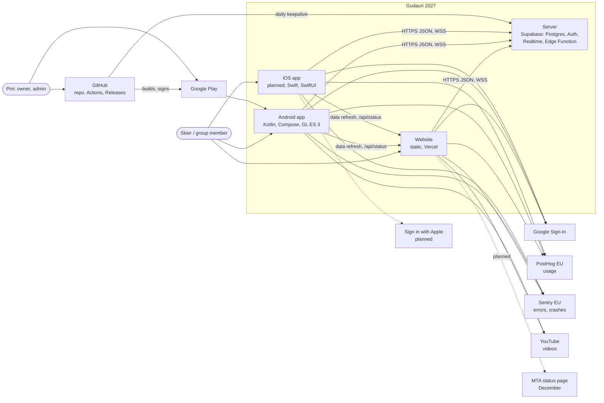
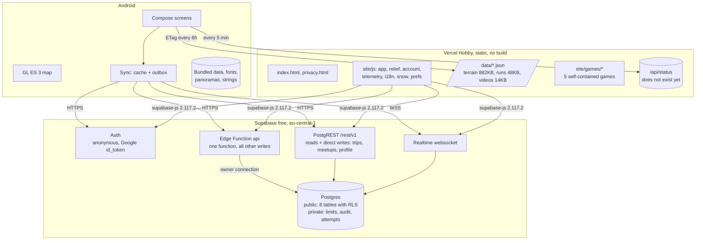
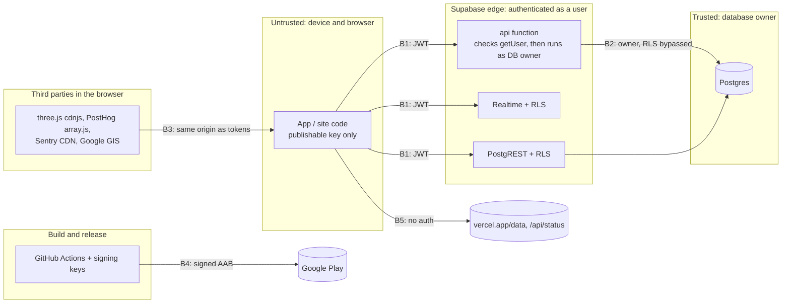

# ארכיטקטורת המערכת

**המסמך הזה הוא המפה של המערכת:** אילו רכיבים יש, מי מדבר עם מי ובאיזה פורמט, מה מותר לכל אחד, כמה זה עומד בעומס, מה יכול להישבר, ומה הסדר הנכון לאייפון. הבעלים: ארכיטקט המערכת (`docs/ROLE-ARCHITECT.md`, החלטה 51).

עדכון אחרון: 4.10.2026 (קו בסיס, מהקוד בענף הראשי `788050f`, ובדיקה מול `01fe250`).

**איך נבנה קו הבסיס:** קריאה של הקוד עצמו, לא רק של המסמכים: האתר (`site/`), האנדרואיד (`app/android/`), השרת והמיגרציות (`server/`), תהליכי GitHub (`.github/workflows/`) וההגדרות של Vercel (`site/vercel.json`). כל טענה מפנה לקובץ ולשורה. המגבלות של השירותים החיצוניים נבדקו מול האתרים שלהם ב-3.10.2026, וצריך לבדוק אותן שוב לפני כל החלטה שנשענת עליהן.

**בלי כפילויות:** החוזה של השרת ב-`server/CONTRACT.md`. חוזה המדידה ב-`docs/GROWTH.md`. הפערים בין הפלטפורמות ב-`docs/PARITY.md`. ההחלטות עצמן ב-`docs/STATUS.md`. כאן רק המבנה, הנימוק, המספרים והסיכונים, עם הפניות.

---

## 1. הקשר (C4, רמה 1)



## 2. מכולות (C4, רמה 2)



| מכולה | טכנולוגיה | נתונים שהיא מחזיקה | איפה בקוד |
|---|---|---|---|
| אתר | HTML, CSS ו-JS בלי שלב בנייה, three.js r128 מ-cdnjs | הטיול, ההעדפות, השיאים, העותק של הקבוצה והאסימונים, כולם בזיכרון הדפדפן | `site/` |
| אנדרואיד | `Kotlin` 2.4, `Compose`, `OpenGL ES 3`, `minSdk 26`, `targetSdk 36` | נתוני המפה ארוזים, הטיול, הסשן, עותק הקבוצות ותור כתיבות | `app/android/` |
| אייפון | `Swift`, `SwiftUI` (מתוכנן) | כמו באנדרואיד | `app/ios/` (ריק) |
| שרת | סופבייס: פוסטגרס, `Auth`, `PostgREST`, `Realtime`, פונקציה אחת ב-`TypeScript` (`Deno`) | חשבונות, קבוצות, הזמנות, טיולים, מפגשים, שיאים, יומן פעולות | `server/` |
| בנייה ושחרור | GitHub Actions, גרסאות בגיטהאב, גוגל פליי | מפתחות חתימה בכספת, קובצי התקנה בקישור קבוע | `.github/workflows/` |
| מדידה | PostHog (אירופה), Sentry (אירופה) | אירועים בלי פרטים מזהים, קריסות | `site/js/telemetry.js`, `telemetry/Telemetry.kt` |

## 3. רכיבים (C4, רמה 3)

### אתר

| רכיב | תפקיד | הערות |
|---|---|---|
| `i18n.js` | בחירת שפה (`?lang=`, בחירה שמורה, הדפדפן), כיוון וגופנים, `T()` | נטען ב-`head` |
| `prefs.js`, `telemetry.js` | צליל, רטט ומתג המדידה; PostHog ו-Sentry | המדידה דלוקה כברירת מחדל, ומתג כיבוי בהגדרות |
| `relief.js` | `GudRelief`: מודל הגובה, שיפועים, `View3D` על three.js | ספי השיפוע במקום אחד (`GudRelief.SLOPE`) |
| `app.js` | `main()`: טוען את שלושת קובצי הנתונים ואז בונה הכל (בית, מפה, מפגש, משחקים, אודות, מצב רכבלים) | `site/js/app.js:3-8`: לא מצייר כלום עד שכל הקבצים נטענו |
| `account.js` | חשבון וקבוצה מול השרת, עם `supabase-js` מהאתר עצמו | נטען לשרת רק כשיש חיבור או הזמנה (`account.js:25-28`) |
| `snow.js`, `lang-picker.js` | השלג על השלטים, בורר השפה | |
| `site/games/*` | חמישה משחקים, כל אחד בעמוד משלו | נבנים מ-`design/` (`tools/build-games.py`) |

### אנדרואיד

| חבילה | תפקיד | תלויה ב |
|---|---|---|
| `MainActivity.kt` | המסך היחיד: כל המצב, הניווט, הטעינה, התקתוקים | הכל |
| `data/` | הנתונים הארוזים ועדכון מהאתר, מנתחים, `RunFacts` (זהה לאתר) | כלום |
| `map/` | המפה ב-GL: רשת, מצלמה, מחוות, שמיים ושמש, פאנל המסלול | `data`, `status`, `ui` |
| `server/` | הלקוח של השרת: `Http`, `Auth`, `Server`, `Groups`, `Sync`, `Realtime`, `TripSync` | `trip`, `group` (ראו סיכון R-9) |
| `group/`, `account/` | מסכי הקבוצה והחשבון, `GroupApi` ומימושים | `server` |
| `home/`, `trip/`, `meet/`, `status/`, `game/` | מסכי הפיצ'רים | `ui`, `data` |
| `i18n/`, `ui/`, `nav/`, `telemetry/`, `fx/`, `perf/`, `qa/` | שפה, טוקנים, ניתוב, מדידה, צליל ורטט, מונה פריימים, נקודות בדיקה | |

**תלויות חיצוניות** (`app/android/app/build.gradle.kts:128-145`): `Compose BOM` 2026.09.00, `posthog-android` 3.71.4, `sentry-android-core` 8.59.0, `credentials` 1.6.0 ו-`googleid` 1.2.1, `okhttp` 5.1.0 (רק לזמן אמת), `installreferrer` 2.2.

### שרת

| רכיב | תפקיד | איפה |
|---|---|---|
| טבלאות `public` | `profiles`, `trips`, `groups`, `group_members`, `invites`, `join_requests`, `meetups`, `scores`, עם הרשאות לכל שורה | `migrations/20261001120000_schema.sql` |
| `private` | `limits()`, `audit_log`, `invite_attempts`, `merge_tickets`, `heartbeat`, ופונקציות העזר להרשאות (`search_path=''`) | אותה מיגרציה, ו-`20261003120000` |
| שומרים | `trips_guard` (20 לאדם), `group_members_guard`, `meetups_guard` (300 לקבוצה), `profile_name_to_groups` | מיגרציות |
| פונקציה `api` | ניתוב לפי שם הפעולה, אימות האסימון, טרנזקציה לכל פעולה, קודי שגיאה קצרים, שורת לוג לכל בקשה | `functions/api/index.ts`, `actions.ts` |
| משימה יומית | `keepalive`: כתיבה למסד הנתונים וניקוי (ניסיונות, כרטיסים, יומן, אורחים נטושים) | `.github/workflows/server-keepalive.yml`, `actions.ts:729-753` |

---

## 4. זרימות הנתונים

### 4.1 הטיול שלך

- **בלי חשבון:** נשמר רק במכשיר. באתר `gud-trip` בזיכרון הדפדפן (`site/js/app.js:45`); באנדרואיד בהעדפות `trip` (`trip/Trip.kt:101-104`).
- **אחרי הצטרפות לקבוצה:** שורה אחת לאדם בטבלה `trips`, בכתיבה ישירה עם הרשאות לכל שורה (החלטה 27). הקבוצה רואה את הטיול רק אם `group_members.trip_id` מצביע עליו (`private.can_see_trip`), כלומר רק בקבוצה שבה האדם בחר להציג אותו (ד1 בחוזה).
- **באנדרואיד** `ServerTripSync` שומר שינוי אחד שמחכה, סימן מחיקה ומזהה השורה (`server/TripSync.kt:27-78`), ונשלח בפתיחה. **באתר אין תור:** שמירה בלי קליטה הולכת לאיבוד בשרת (פער P-D6 ב-`docs/PARITY.md`).
- **"אני על אותה טיסה":** `same_flight` דורס את השורה של האדם (`my_trip_id`), והלקוח מאמץ את המזהה שחזר.

### 4.2 הצטרפות לקבוצה

```mermaid
sequenceDiagram
  participant C as Client
  participant A as Auth
  participant F as api function
  participant D as Postgres
  C->>F: invite_preview(code)
  Note over C,A: no session yet: guest identity is created only here
  C->>A: POST /auth/v1/signup (anonymous)
  A-->>C: access + refresh token
  C->>F: join_group(code or token)
  F->>A: getUser(token)
  F->>D: begin; check attempts (5/15min, 20/day, 300/h global)
  F->>D: find invite (not revoked, uses < max, not expired)
  F->>D: lock group; insert member or join_request; uses+1
  F-->>C: {status: joined | pending | invalid_code | ...}
  C->>D: GET /rest/v1/groups,... (RLS: members only)
  C->>C: write local copy
```

הקוד: שש אותיות מתוך 24 (כ-1.9×10⁸ צירופים), או אסימון של 192 סיביות בקישור (`actions.ts:117-132`).

### 4.3 זמן אמת ועבודה בלי קליטה

- **קריאה:** כל קבוצה נשמרת בעותק מקומי ומוצגת מיד (באנדרואיד `filesDir/server/groups/<id>.json`, באתר `gud-group-<id>`).
- **זמן אמת:** הודעה מהשרת רק מעוררת קריאה מחדש דרך ההרשאות, ולא נושאת נתונים (`server/Realtime.kt:126-134`). באנדרואיד חיבור אחד, פעימה כל 25 שניות, וחיבור מחדש בהמתנה שמכפילה את עצמה עד דקה.
- **כתיבה:** באנדרואיד תור שנשמר בקובץ (`outbox.json`) ונשלח בפתיחה, אחרי כתיבה חדשה ואחרי חיבור מחדש של זמן האמת (`server/Sync.kt:150-170`). מפגש נושא מזהה מהלקוח, ולכן שליחה חוזרת לא יוצרת כפילות; שיא נשמר רק אם הוא גבוה יותר. **התנגשות:** האחרון גובר.
- **באתר:** אין תור כתיבות (החלטה 50: "לא עכשיו").

### 4.4 שיאים

משחק מסתיים, השיא נשמר במכשיר, ו-`submit_score` שולח אותו לשרת, ששומר רק את הגבוה ביותר לאדם ולמשחק (`actions.ts:696-711`). באתר מאירוע `game_end` (`site/js/telemetry.js`, `sendBests` ב-`site/js/account.js:440`). באפליקציה עוד לא (13.6). **השרת סומך על הלקוח:** אפשר לזייף שיא. זה מקובל בטבלה של חברים, ולא מקובל אם יהיו פרסים.

### 4.5 מדידה

אירועים לפי החוזה ב-`docs/GROWTH.md`. בלי `identify`, בלי כתובת IP, בלי הקלטות מסך. באתר מזהה אקראי בזיכרון הדפדפן (החלטה 37); באנדרואיד `PersonProfiles.NEVER` (`telemetry/Telemetry.kt:61-67`). Sentry בלי פרטים אישיים כברירת מחדל, ובלי צילומי מסך. **בשני הצדדים המדידה דלוקה כברירת מחדל**, עם מתג כיבוי.

### 4.6 עדכון הנתונים מהאתר באפליקציה

```mermaid
sequenceDiagram
  participant App
  participant Site as vercel.app/data
  App->>App: load bundled terrain, runs, videos (assets)
  App->>App: if downloaded copy exists and app version unchanged, use it
  App->>Site: GET runs-and-lifts.json, videos-seed.json (If-None-Match, max every 6h)
  Site-->>App: 304, or 200 (cap 4MB, HTTPS, no redirects)
  App->>App: parse with the app's own parser; reject if schema > 1
  App->>App: atomic write; used from the next launch
```

`data/SiteData.kt:41-113`. **מודל הגובה (`terrain.json`) לא מתעדכן**, רק בגרסה חדשה. **אף קובץ עוד לא נושא את השדה `schema`**, ו-`videos-seed.json` הוא מערך, ולכן אי אפשר להוסיף לו שדה כזה בלי לשבור גרסאות ישנות (ראו המלצה מ-3).

---

## 5. גבולות האמון



| גבול | מה עובר | ההגנה היום |
|---|---|---|
| B1: מכשיר לשרת | אסימון זהות, קריאות וכתיבות | הרשאות לכל שורה, עמודות שמותרות לכתיבה, שומרים, בדיקות (`server/supabase/tests/`) |
| B2: הפונקציה למסד הנתונים | כל הכתיבות הרגישות | **רק בדיקות בקוד** (`requireMember`, `requireAdmin`). הפונקציה מתחברת כבעלים (`functions/api/index.ts:16`), ולכן הרשאות השורות לא חלות עליה. ההערה ב-`actions.ts:5-8` ("באג כאן לא יפתח נתונים") לא מדויקת לגבי הפונקציה עצמה |
| B3: סקריפטים של צד שלישי באתר | גישה מלאה לדף, כולל האסימונים | **אין** `Content-Security-Policy` ואין `integrity` (פער S-22) |
| B4: בנייה לחנות | מפתח ההעלאה | סודות בכספת, בדיקת טביעת האצבע (`android.yml:80-86`). פעולות של צד שלישי לפי תגית ולא לפי `SHA` |
| B5: האפליקציה לאתר | נתוני המפה, מצב הרכבלים | HTTPS בלבד, תקרה של 4MB, בדיקה בנתח של האפליקציה. אין חתימה על הנתונים |

---

## 6. דרישות שאינן פונקציונליות

**"נמדד"** = יש מספר אמיתי מהקוד, מהבדיקות או מהשרת. **"לא נמדד"** = יעד בלי מדידה.

| דרישה | יעד | היום | נמדד? |
|---|---|---|---|
| טעינה ראשונה של האתר בטלפון | פחות מ-3 שניות לדף הבית ב-4G; דף הבית לא מחכה למפה | **אחרי R-11 (ענף `claude/site-parity`, 5.10.2026):** דף הבית לא מחכה ל-`terrain.json`, ו-three.js נטען רק בכניסה למפה. נמדד בטלפון ברוחב 390, ב-Fast 3G של DevTools (562.5ms, 180KB/s), בלי מטמון ועם דחיסה, חציון של שלוש ריצות עד שדף הבית מצויר: **6,599ms לפני, 3,013ms אחרי.** ב-4G המהיר יותר זה מתחת ליעד | כן (מדידה של סשן האתר, ב-3G מדומה; לא בטלפון אמיתי) |
| גודל האפליקציה | פחות מ-15MB | `.aab` של 0.1.41: 8.5MB | כן |
| פתיחת האפליקציה | פחות מ-2 שניות לפריים הראשון (`docs/APP-NATIVE.md`) | נמדד רק באמולטור ובפס המדידה של גרסת הבדיקה | חלקית, לא בטלפונים של משתמשים |
| פריימים במפה ובמשחק | 60 קבועים | `perf/FrameStats` בגרסת הבדיקה בלבד; האמולטור מצייר בתוכנה | לא בשטח |
| זיכרון המפה | פחות מ-100MB | כ-20MB לרשת ההר (`map/MapScene.kt:33-58`) | הערכה מהקוד |
| סוללה | בלי עבודה ברקע; ציור רק כשמשהו זז | `RENDERMODE_WHEN_DIRTY`. אבל מצב הרכבלים נשאל כל 5 דקות כל השנה, מול כתובת שלא קיימת | לא |
| עבודה בלי קליטה | המפה, הטיול, הקבוצה והמפגשים נפתחים בלי רשת; כתיבות מחכות | באנדרואיד: כן. באתר: קריאה מהעותק, בלי תור | בבדיקות יחידה |
| זמן תגובה של השרת | פחות משנייה ל-95% מהפעולות | כחצי שנייה עם `x-region`, כ-1.8 בהתחלה קרה (`server/README.md:36`) | בבדיקה ידנית בלבד |
| זמינות השרת | 99% בעונה (10.12 עד 31.3) | אין התחייבות בתוכנית החינמית; אין התרעה | לא |
| שחזור | איבוד של יום לכל היותר, שחזור תוך שעה | **אין גיבוי.** בתוכנית החינמית אין גיבויים אוטומטיים ([תיעוד סופבייס](https://supabase.com/docs/guides/platform/backups.md)) | — |

**המגבלות של התוכניות החינמיות** (נבדק 3.10.2026):

| שירות | המגבלה | השימוש הצפוי בעונה (אלפיים משתמשים פעילים, הנחה) | מה קורה כשמגיעים | התרעה היום |
|---|---|---|---|---|
| סופבייס | מסד נתונים 500MB, 50 אלף משתמשים בחודש, 500 אלף קריאות לפונקציה, 200 חיבורי זמן אמת בבת אחת, 5GB תעבורה, השהיה אחרי שבוע בלי פעילות ([מחירון](https://supabase.com/pricing.md)) | מסד נתונים: עשרות MB. קריאות: עשרות אלפים. **חיבורי זמן אמת: הראשון שייגמר**, כי כל דף קבוצה פתוח מחזיק חיבור | חיבורים נוספים נדחים; השהיה עוצרת הכל | מייל מסופבייס בלבד |
| Vercel Hobby | 100GB תעבורה, **שימוש לא מסחרי בלבד**, משימה מתוזמנת פעם ביום ([מדיניות](https://vercel.com/docs/limits/fair-use-policy), [משימות](https://vercel.com/docs/cron-jobs/usage-and-pricing)) | כ-1.1MB לביקור ראשון: כ-90 אלף ביקורים ראשונים בחודש | האתר נעצר עד החודש הבא | אין |
| PostHog | מיליון אירועים בחודש ([מחירון](https://posthog.com/pricing)) | כ-50 אירועים למשתמש ביום | האירועים נזרקים | לא הוגדרה |
| Sentry | 5,000 שגיאות בחודש, משתמש אחד | תקלה אחת בלולאה יכולה לגמור את זה ביום | השגיאות נזרקות | לא הוגדרה |
| GitHub Actions | חינם בריפו ציבורי; משימות מתוזמנות נעצרות אחרי 60 יום בלי פעילות בריפו | | המשימה היומית נעצרת, והשרת מושהה אחרי שבוע | מייל מגיטהאב |

---

## 7. מודל איומים (STRIDE)

| # | גבול | סוג | איום | ההגנה היום | מה חסר | חומרה |
|---|---|---|---|---|---|---|
| T-1 | B2 | העלאת הרשאות | פעולה בלי בדיקת חברות או ניהול חושפת או משנה קבוצה של אחרים | בדיקות בקוד ו-11 תרחישים (`server/tests/api.test.ts`) | בדיקה שיטתית: כל פעולה מול זר, חבר ומנהל | גבוהה |
| T-2 | B3 | גניבת זהות | סקריפט של צד שלישי שנפרץ קורא את אסימון החידוש מזיכרון הדפדפן | אין | `Content-Security-Policy`, `integrity`, three.js מהאתר עצמו, PostHog בגרסה נעוצה | גבוהה |
| T-3 | B1 | מניעת שירות | אלפי ניסיונות שגויים מזהויות אנונימיות זולות סוגרים את ההצטרפות בקוד לכולם (תקרה כללית של 300 בשעה) | 30 זהויות בשעה לכתובת IP | תקרה לפי קבוצה או לפי IP במקום תקרה כללית | בינונית |
| T-4 | B1 | חשיפת מידע | מי שמחזיק קוד של הזמנה פתוחה רואה שמות ומזהים של החברים | מוסתר כשנדרש אישור (החלטה 43) | החלטה של פיני אם להסתיר תמיד | נמוכה |
| T-5 | B1 | זיוף | "אני כבר בקבוצה" כאורח אחר | אישור מנהל (החלטה 43) | ההעברה לוקחת את **כל** השיאים של האורח, לא רק של הקבוצה (`actions.ts:312-316`) | נמוכה |
| T-6 | B1 | שינוי | `set_member_trip` דורס טיול שמנהל של קבוצה אחרת הזין | בעלים מול מי שהזין (`actions.ts:680`) | בדיקה שהטיול מוצג רק בקבוצה הזו | נמוכה |
| T-7 | האתר | שינוי | הטמעת `/account` בדף זר ולחיצה על המחיקה | אין `frame-ancestors` | כותרת `frame-ancestors 'none'` | בינונית |
| T-8 | אנדרואיד | גניבת זהות | אסימון החידוש בקובץ העדפות רגיל | הגיבוי כבוי (`AndroidManifest.xml:18`) | הצפנה במפתח של המכשיר; כללי העברה בין מכשירים (אנדרואיד 12 ומעלה) | נמוכה |
| T-9 | אנדרואיד | זיוף | אפליקציה אחרת שולחת למסך הראשי קישור או `open` ומובילה להצטרפות | רק המארח של האתר ב-HTTPS (`nav/Nav.kt:99-101`) | אישור מהמשתמש לפני הצטרפות מקישור (קיים: מסך התצוגה המקדימה) | נמוכה |
| T-10 | B4 | שינוי | פעולת GitHub של צד שלישי שהתגית שלה הוזזה רצה עם מפתח ההעלאה | בדיקת טביעת אצבע אחרי החתימה | פעולות לפי `SHA`; הרשאות `contents: read` כברירת מחדל; בלי `curl \| sh` (`android.yml:78`) | בינונית |
| T-11 | B5 | זיוף | שינוי לא זהיר בנתוני האתר שובר את המפה בטלפונים | הנתח של האפליקציה דוחה קובץ פגום | `schema` מפורש, ובדיקה ב-GitHub שגרסת האפליקציה האחרונה קוראת את הנתונים | בינונית |
| T-12 | כל הלקוחות | חשיפת מידע | חוסר תאימות בין הקוד למדיניות הפרטיות; המדידה דלוקה כברירת מחדל באירופה | המדיניות מעודכנת, מתג כיבוי | בדיקה מול GDPR לפני היציאה לציבור (החלטה 37); `beforeSend` ב-Sentry שמנקה הודעות | בינונית |
| T-13 | השרת | הכחשה | אין עקבות לפעולה | יומן פעולות 180 יום, לוג של יום | מספיק לגודל הפרויקט | — |

---

## 8. מצב הטכנולוגיות

**בשימוש** (לא מחליפים בלי סקירה):

| תחום | בחירה | גרסה | הערה |
|---|---|---|---|
| אתר | HTML, CSS ו-JS בלי שלב בנייה | | החלטה 1, שלב 1 |
| תלת-ממד באתר | three.js r128 | 2021, מ-cdnjs | ישנה; לא לשדרג לפני העונה בלי סיבה. להעביר לאתר עצמו |
| שרת באתר | `supabase-js` | 2.117.2, בתוך האתר | |
| אנדרואיד | `Kotlin`, `Compose`, `OpenGL ES 3` | `Kotlin` 2.4.20, `AGP` 9.4.1 | החלטה 25 |
| שרת | סופבייס, פונקציה ב-`Deno` עם `postgres.js` | | החלטות 28, 40 |
| זמן אמת באנדרואיד | `OkHttp` | 5.1.0 | רק לחיבור אחד |
| כניסה | גוגל דרך `Credential Manager`; אפל כשיהיה חשבון | | החלטה 27 |
| מדידה | PostHog, Sentry | 3.71.4, 8.59.0 | החלטה 32 |
| בדיקות | Playwright, `JUnit` 4, `pgTAP`, `Deno test`, אמולטור ב-GitHub | | |

**בבדיקה:** אין כרגע.

**לא להכניס בלי סקירה:**
- ספריית `ViewModel` או הזרקת תלויות באנדרואיד באמצע, בלי תוכנית (ראו R-9).
- ספרייה נוספת לרשת או ל-JSON באנדרואיד (יש `HttpURLConnection` ו-`org.json`).
- שלב בנייה לאתר (כלי אריזה): מחיר גבוה, תועלת לא מוכחת. ניסיון קודם שבר פריסה (`docs/ROADMAP.md`, גרסת האתר במדידה).
- כל שירות חיצוני חדש שמקבל נתונים של משתמשים, בלי עדכון של מדיניות הפרטיות.

---

## 9. סיכונים וחוב טכני

מדורג לפי השפעה כפול סבירות, בהקשר של היעד היחיד (החלטה 29). **בעלים** = הסשן שמחזיק בתחום בטבלה "מי עובד על מה". המימוש עובר דרך סשן המנהל.

| # | סיכון | השפעה | סבירות | המלצה | בעלים |
|---|---|---|---|---|---|
| R-1 | **אין גיבוי למסד הנתונים.** מיגרציה גרועה או טעות בשרת החי מוחקות את כל הקבוצות, בלי דרך חזרה | גבוהה | בינונית | לפני שהבודקים מתחילים: גיבוי יומי מוצפן (מ-1) | פיני מחליט, סשן השרת |
| R-2 | **הפונקציה רצה כבעלים של מסד הנתונים** (`index.ts:16`). פעולה אחת שחסרה בה בדיקה פותחת כל קבוצה | גבוהה | בינונית | מטריצת בדיקות: כל פעולה מול זר, חבר ומנהל. לתקן את ההערה ב-`actions.ts:5-8` | סשן השרת |
| R-3 | **אסימונים בזיכרון הדפדפן, בלי `CSP` ובלי `integrity`** על ארבעה סקריפטים חיצוניים (PostHog בגרסה "אחרונה") | גבוהה | נמוכה עד בינונית | `CSP` ו-`frame-ancestors` (S-22), three.js מהאתר, PostHog בגרסה נעוצה | סשן האתר |
| R-4 | **חוזה הנתונים בין האתר לאפליקציות לא כתוב,** וכתובת `gudauri-ski-trip.vercel.app` קבועה בקוד האפליקציה (`SiteData.kt:41`, `LiftStatus.kt:122`, `GroupApi.kt:228`). שינוי בקובץ או בדומיין שובר או מקפיא גרסאות שכבר בטלפונים | גבוהה | בינונית | מ-3: חוזה נתונים כתוב, והכתובת הקיימת נשארת לתמיד גם אם יהיה דומיין | ארכיטקט, סשני האתר והאנדרואיד |
| R-5 | **מצב הרכבלים: אין רכיב שמביא את הנתון, ואין לו בעלים.** Vercel Hobby לא מריץ משימה יותר מפעם ביום | בינונית בעונה | גבוהה | מ-2: פונקציה בסופבייס, וכתובת `/api/status` באתר שמפנה אליה | פיני מחליט, סשן השרת |
| R-6 | **אנדרואיד: תשובה מוצלחת שאינה JSON מפילה את האפליקציה.** תור הכתיבות תופס רק `Offline` ו-`ServerError` (`server/Sync.kt:132-136`, `155-166`), ו-`JSONObject(...)` ב-`Server.kt:43-84` זורק חריגה על השרשור של התור | גבוהה | נמוכה עד בינונית | כל תשובה שלא מתפרשת = `ServerError("bad_response")`; בדיקת יחידה | סשן השרת (החבילה `server/` באפליקציה) |
| R-7 | **אנדרואיד: כתיבה שנתקעת חוסמת את כל התור,** בלי המתנה ובלי ניסיון חוזר עד הפתיחה הבאה (`Sync.kt:162`) | בינונית | בינונית | ניסיון חוזר עם המתנה שגדלה, ומאזין לחזרת הרשת | סשן השרת |
| R-8 | **מספר הגרסה באנדרואיד הוא מספר הריצה של `android.yml`** (`android.yml:30`). שינוי שם של התהליך מאפס אותו, וגוגל פליי תסרב לכל העלאה | גבוהה | נמוכה | מ-4: מספר בסיס קבוע בקוד, ובדיקה שהמספר עולה | סשן האנדרואיד |
| R-9 | **`MainActivity` מחזיק את כל המצב,** ויש מעגל תלויות בין `server` ל-`group`. קשה לבדוק, מצב הולך לאיבוד כשהמערכת סוגרת את האפליקציה, והאייפון עלול להעתיק את המבנה | בינונית | גבוהה | לא לשכתב לפני העונה. לפרק בהדרגה, ולתכנן את האייפון נכון מההתחלה (סעיף 11) | סשן האנדרואיד |
| R-10 | **שרשרת השחרור:** פעולות לפי תגית, `contents: write` עם מפתחות החתימה, `curl \| sh`, וגרסאות קבועות שנמחקות ונוצרות מחדש (רגע של 404 בקישור, בלי היסטוריה) | גבוהה | נמוכה | פעולות לפי `SHA`; הרשאות מינימליות; `sentry-cli` בגרסה נעוצה | סשן האנדרואיד. **טופל (5.10.2026)** |
| R-11 | **טעינה ראשונה איטית באתר:** דף הבית מחכה ל-560KB של מודל הגובה ול-three.js | בינונית | גבוהה | לטעון את מודל הגובה ו-three.js רק כשנכנסים למפה | סשן האתר |
| R-12 | **ההשהיה של סופבייס תלויה במשימה של GitHub** שכבר מגיעה באיחור, ונעצרת אחרי 60 יום בלי פעילות בריפו. אין התרעה | גבוהה | נמוכה | התרעה חיצונית חינמית על `keepalive` (בדיקת זמינות), או משימה בתוך סופבייס (`pg_cron`) | סשן השרת |
| R-13 | **ניחושים שגויים יכולים לסגור הצטרפות בקוד לכולם** (T-3) | בינונית | בינונית | תקרה לפי קבוצה במקום תקרה כללית | סשן השרת |
| R-14 | **שדה שלא נשלח מוחק נתון:** `update_group` ו-`set_my_membership` מאפסים תאריכים ו-`trip_id` כשהם חסרים (`actions.ts:417-418`, `619`), והחוזה לא אומר את זה | בינונית | בינונית | לכתוב בחוזה, ולהבדיל בין "לא נשלח" ל-`null` | סשן השרת |
| R-15 | **מחיקת חשבון לא אטומית:** המחיקה במסד הנתונים נשמרת, ומחיקת הזהות אחריה יכולה להיכשל (`actions.ts:357-364`) | בינונית (דרישה של גוגל פליי) | נמוכה | ניסיון חוזר במשימה היומית לזהויות שנשארו | סשן השרת |
| R-16 | **פרטיות:** המדידה דלוקה כברירת מחדל גם באירופה, ו-Sentry בלי ניקוי הודעות | בינונית | בינונית | מ-5 | פיני מחליט |
| R-17 | **Vercel Hobby אוסר שימוש מסחרי.** מודעות וקישורי שותפים (שלב 14) מחייבים תוכנית בתשלום | בינונית | ודאית כשיהיו מודעות | לתכנן מעבר לפני מודעה ראשונה | פיני |
| R-18 | **אנדרואיד, קטנים:** קוד הבקשה של התזכורת הוא `hashCode()` (התנגשות אפשרית, `meet/Reminders.kt:86`); שאילתת מצב הרכבלים כל השנה; רענון אסימון ברשת בתוך נעילה של זמן האמת (`Realtime.kt:115`) | נמוכה | בינונית | לתקן כשנוגעים בקבצים | סשני האנדרואיד והשרת. **טופל (5.10.2026, סשן האנדרואיד)** |
| R-19 | **מהירות השרת:** בדיקת האסימון ברשת בכל בקשה, ובלי מגבלת זמן לשאילתות (`index.ts:16`, `42-47`) | בינונית | בינונית | למדוד בשימוש אמיתי לפני שמשנים (`docs/ROADMAP.md`) | סשן השרת |
| R-20 | **מירוצים קטנים בשרת:** תקרת השימושים בהזמנה נבדקת לפני הנעילה (`actions.ts:229`, `489`); ספירת הניסיונות לא אטומית | נמוכה | נמוכה | נעילה לפני הבדיקה | סשן השרת |

---

## 10. החלטות טכניות

**ההחלטות שכבר התקבלו נמצאות ב-`docs/STATUS.md`, וכאן רק ההפניה:**

| נושא | החלטות |
|---|---|
| מקור האמת, ריפו אחד, בלי כלי מונו־ריפו, קובץ הוראות לכל פרויקט | 1, 34 |
| אתר סטטי ב-Vercel | 2, 4, 7 |
| אפליקציות נייטיב מלא, האפליקציה לא מחקה את האתר | 14, 22, 25, 35 |
| משתמשים, אורח, גוגל ואפל, קבוצות | 26, 27, 43 |
| סופבייס חינמי, שרת עם קוד בפונקציה אחת | 6, 28, 40 |
| הפצה, חתימה וחנויות | 31, 33 |
| מדידה ומזהה מבקר | 32, 37 |
| שפות | 32, 39, 41, 47, 48 |
| עבודה במקביל, יישור בין הלקוחות, ארכיטקט | 45, 50, 51 |
| החוזה של השרת וכללי השינוי בו | `server/CONTRACT.md` |

### סקירות תכנון

| תאריך | מה | מי ביקש | תשובה |
|---|---|---|---|
| 4.10.2026 | S-28: קובץ האימות לקישורים (`site/.well-known/assetlinks.json`), עם הטביעות של מפתח ההעלאה ומפתח הבדיקה | סשן האתר | **מאושר עם תנאים.** (1) לפני המיזוג: בתצוגה המקדימה של הענף הקובץ מחזיר 200 בלי הפניה, עם `Content-Type: application/json`. (2) A-31 (מסנן הקישורים עם `autoVerify` באנדרואיד) לא עולה לגוגל פליי לפני שטביעת ה-SHA-256 של מפתח החתימה של גוגל בקובץ. אחרת האימות של גרסת החנות נכשל. הקובץ לבדו לא משנה כלום בטלפונים, כי עוד אין אפליקציה שמבקשת אימות |
| 4.10.2026 | סשן השרת, ענף `claude/server-arch`: תיקוני R-2, R-6, R-7, R-12, R-13, R-14, R-15, R-20, ומיגרציה `20261004120000_hardening.sql` | סשן השרת | **מאושר עם תיקונים.** R-13: כתובת הרשת לפי `cf-connecting-ip`, אחר כך `x-real-ip`, ואחר כך **הרשומה האחרונה** ב-`x-forwarded-for` (הראשונה בידי הלקוח); בלי כתובת אמינה לא סופרים לפי כתובת; הבדיקה אחרי הפריסה, עם כותרות מזויפות, היא תנאי. במקום תקרה כללית שחוסמת, **מצב הגנה**: מעל 1000 ניסיונות שגויים בשעה בכל המערכת, קוד נכון של שש אותיות מחזיר `pending` (אישור מנהל) במקום `joined`. מפתח נגזר לגיבוב, ולא מפתח השירות עצמו. **הגיבוב של הכתובת הוא מידע אישי:** צריך שורה ב-`docs/PRIVACY.md` באישור פיני, ו-R-13 לא נפרס לפני כן. R-7: חסרה ההרשאה `ACCESS_NETWORK_STATE` במניפסט (סשן האנדרואיד), אחרת המאזין לרשת לא עובד בשקט. השאר מאושר כמו שהוא. **התיקונים בוצעו ונבדקו (`cf4049b`, `fefd3e2`): מאושר.** נשארו: שורת הפרטיות באישור פיני לפני פריסה של R-13, ההרשאה במניפסט אצל סשן האנדרואיד, ובדיקת הכותרות המזויפות אחרי הפריסה |
| 4.10.2026 | R-3 ו-S-22 (three.js ו-PostHog באתר עצמו, `CSP` ושאר הכותרות) ו-R-11 (דף הבית לא מחכה למודל הגובה, three.js רק בתלת-ממד) | סשן האתר | **מאושר עם תיקונים.** PostHog בגרסה `array.no-external.js` (בלי טעינת תוספים); גם Sentry לאתר עצמו, ולכן ב-`script-src` רק `'self'` והספרייה של גוגל; התמונה של "מי בנה" לאתר עצמו (או `github.com` ו-`avatars.githubusercontent.com` ב-`img-src`); הסקריפט המוטמע בכל משחק עובר לקובץ דרך `tools/build-games.py`, בלי `'unsafe-inline'` ב-script; גם `X-Frame-Options: DENY`, `Strict-Transport-Security`, ו-`Cross-Origin-Opener-Policy: same-origin-allow-popups` (בגלל חלון הכניסה של גוגל). מצב דיווח בלבד לריצה אחת: Playwright נכשל על כל `securitypolicyviolation`, בלי לשלוח דוחות לשירות חיצוני, ואז אכיפה לפני המיזוג. R-11: קישור ישיר שמגיע לפני מודל הגובה מבוצע כשהוא מגיע (בדיקה עם עיכוב), מדידה לפני ואחרי בטלפון עם האטה של 3G, ופורמט הנתונים לא משתנה (מ-3) **בוצע ונבדק (5.10.2026, ענף `claude/site-parity`): מאושר.** שלוש הספריות באתר עצמו (three.js r128, PostHog 1.436.1 בגרסה בלי תוספים, Sentry 8.38.0), ב-`script-src` רק `'self'` והספרייה של גוגל, `frame-ancestors 'none'`, הכותרות כמו שביקשתי, ובדיקה שנכשלת על כל הפרה בכל הדפים והמשחקים. R-11: 6.6 שניות לפני, 3.0 אחרי (סעיף 6). **שימו לב למ-7:** `Permissions-Policy` חוסם היום `geolocation`, וכשהמיקום ייכנס צריך לשנות ל-`geolocation=(self)`; אחרת הכפתור לא יעבוד באתר |
| 5.10.2026 | מזג אוויר ורוח לפי גבהים, ומיקום עצמי (החלטה 57) | סשן המנהל | **הצעה, ממתינה לפיני:** מ-6 (השרת מביא מ-Open-Meteo פעם בשעה, והלקוחות קוראים `/api/weather`) ו-מ-7 (המיקום לא עוזב את המכשיר, הרשאה בקדמה בלבד, אלגוריתם הצמדה אחד עם ערכי בדיקה משותפים; "קח אותי למטה" לא ב-1.0), עם הטבלה "מה חייב להיות זהה". לא כותבים קוד עד אישור פיני והקנבס |
| 5.10.2026 | ערכי הבדיקה המשותפים של סבב 19: `tools/fixtures/location-m7.json` ו-`tools/fixtures/weather-m6.json` (הצעה לצורת התשובה של `/api/weather`) | סשן האנדרואיד | **מאושר.** **מיקום:** שני הפירושים נכונים ונשארים כלל (דיוק בין 30 ל-50 מ׳ בלי רכבל הוא "לא מדויק"; הרכבל נבדק לפני המסלולים, כי הוא דורש שלוש קריאות של התקדמות בעלייה). ההרשאות והכפתור רק בגרסת הבדיקה עד אישור שורת הפרטיות: נכון. **מזג אוויר:** `snow24` לכל נקודה וסיכון לכל רכבל מקובלים, בתנאי שהשרת מחשב את שניהם (הספים רק שם), ש-`snow24` מוגדר בחוזה כשלג שירד ב-24 השעות **שלפני** `updated`, ושמפתחות הרכבלים הם אותם שמות כמו ב-`lifts` של `/api/status`, כדי שדיווח חי יחליף את ההערכה בחיפוש ישיר. רכבל שלא מופיע: בלי שורת סיכון. **האינטרפולציה לפי גובה נשארת בלקוח:** זה חישוב תצוגה ולא סף, ובשרת היה מחייב את נתוני המסלולים; הערכים בקובץ הם הכלל לכל הפלטפורמות. **עיגול:** חצי כלפי מעלה כמו `Math.round` (‎-2.5 נותן ‎-2); בקוטלין `Math.round`, ובאייפון **לא** `rounded()`, שמעגל חצי הרחק מאפס, אלא `(x + 0.5).rounded(.down)`. שעות בלי אזור הן שעון גודאורי, בטוח כי בגאורגיה אין שעון קיץ. תאימות (מ-3): `schema: 1`, מוסיפים רק שדות, לקוח מתעלם משדה שאינו מכיר; שינוי שובר רק כ-`schema: 2` בכתובת חדשה. הצורה הסופית נקבעת ב-`server/CONTRACT.md` אצל סשן השרת. |
| 5.10.2026 | החוזה של `/api/weather` ותשתית `/api/status` (`server/CONTRACT.md`, טיוטה ב-`ce5b4ca`) | סשן השרת | **מאושר עם שישה תיקונים לפני קוד.** (1) **רק קריאה ציבורית:** ה-`GET` הציבורי קורא את השורה השמורה ולא פונה ל-Open-Meteo או ל-MTA; ההבאה היא פעולה נפרדת שרק המשימה המתוזמנת יכולה להפעיל (סוד בכותרת, שנשמר בכספת של סופבייס ובכספת של `pg_cron`), אחרת כל אחד מכלה את המכסה של Open-Meteo או מפיל את הדף של MTA. (2) **כשל בהבאה לא דורס:** אם Open-Meteo או MTA נכשלים או מחזירים משהו לא תקין, השורה הקודמת נשארת כמו שהיא (`updated` הישן), וכללי העדכניות בלקוח עושים את השאר; אף פעם לא שומרים תשובה חלקית. (3) **"אין נתון" ב-`/api/status` הוא `404` עם `Cache-Control: no-store`**, לא `200` עם `updated: null`: באתר תשובה תקינה בלי `updated` מציגה "אין מידע עדכני" במקום "עוד אין מידע", והאנדרואיד מתעלם מכל מה שאינו `200` ושומר את הדיווח הטוב האחרון; כך שתי הגרסאות הקיימות נשארות נכונות בלי שינוי. אותו כלל ל-`/api/weather` לפני ההבאה הראשונה. (4) **מטמון לפי הקצב:** `/api/status` עם `s-maxage=60` (לא 600, כי הדיווח מתעדכן כל 10 דקות וישן אחרי 30); שגיאה תמיד `no-store`. לפני שהלקוחות עוברים: לבדוק בתצוגה מקדימה ש-Vercel שומר במטמון את התשובה דרך ה-`rewrite` (`x-vercel-cache: HIT` בבקשה השנייה). (5) **הסיכון מוגדר עד הסוף:** לכל שעה ולכל רכבל הערך הגבוה מבין `wind700` והמשבים בנקודה `sadzele` (לשני הרכבלים, כי שניהם על הרכס; אם הכיול בעונה יראה הבדל, מוסיפים נקודה בלי לשנות את הצורה); היומי הוא הגבוה בשעות הרכבלים, 09:00 עד 17:00 בשעון גודאורי, ולא ב-24 השעות. הספים בטבלה, וכל שינוי בהם נרשם ביומן הפעולות. (6) **`null` מותר בכל ערך במערכים**, והלקוח מציג אותו כ"אין נתון" ולא כ-0; להוסיף לקובץ ערכי הבדיקה מקרה אחד כזה. **שאר הטיוטה נכון:** `schema: 1`, שמות הרכבלים זהים לנתונים (`Sadzele`, `Kudebi`), `snow24` לפני `updated`, האינטרפולציה בלקוח, שעון גודאורי בלי אזור, קרדיט חובה והתרעה תפעולית. פריסה ומיגרציה (הטבלה, `pg_cron`, `pg_net`) רק באישור פיני. |
| 6.10.2026 | הקצרת הבדיקה באמולטור של אנדרואיד (`.github/workflows/android-qa.yml`, חמש הצעות) | סשן המנהל, לבקשת פיני | **המלצה: כן, בסדר הזה, ושרשרת השחרור (R-10) לא נפגעת.** **ממצא לפני הכל:** הבדיקה כבר לא רצה בכל דחיפה; היא רצה אוטומטית רק ב-`main` (אחרי מיזוג) ובענף ידנית, כך שהצעה 5 קיימת בפועל, והטקסט ב-`app/android/CLAUDE.md` ("כל דחיפה") מיושן. **שרשרת השחרור:** חתימה ופרסום ב-`android.yml`, בלי תלות בבדיקה באמולטור (אין `workflow_run`, וגם אין שער), ולכן שינויים ב-`android-qa.yml` לא נוגעים בה; התנאי: לא נוגעים ב-`android.yml`, לא מוסיפים סודות לעבודות האמולטור, ושום פעולה חדשה בלי נעיצה לקומיט. **סדר:** (1) **הרצה חוזרת של החלק שנכשל בלבד** (הצעה 1): היום זה לא עובד כמו שצריך, כי הקובץ של האפליקציה נשמר יום אחד בלבד (`retention-days: 1`) והעלאת התוצאות של חלק שחוזר לאותו שם נכשלת (`upload-artifact` גרסה 4 דורש `overwrite: true`); תיקון של שתי שורות (שלושה ימים, ו-`overwrite: true`), ובדיקה אחת שהעבודה `publish` חוזרת ומרכיבה את כל החלקים. הרצה חוזרת מהכלי של גיטהאב (`rerun_failed_jobs`) בלי בנייה חוזרת. סיכון: אפס. (2) **בחירת חלקים לפי הקבצים שהשתנו בהרצה ידנית בענף** (הצעה 4): ערך `auto` לבחירת החלקים, לפי טבלה אחת של תיקייה לחלק (קובץ משלה, לא בתוך ה-workflow); קובץ בתיקיית האפליקציה שאין לו חלק מריץ הכל; `main` תמיד מריץ הכל. סיכון: טבלה שמתיישנת, ולכן כיסוי חסר בענף; מתמתן בכך ש-`main` מריץ הכל אחרי המיזוג. (3) **ניסיון חוזר אחד, רק לכשל תשתית** (הצעה 2): הפעלת האמולטור, התקנה וחיבור `adb`, לא לכשל של בדיקה; בלולאת מעטפת ולא בפעולה חיצונית חדשה; **חלק שעבר רק בניסיון השני נרשם בסיכום כ"לא יציב" (שם החלק והשלב)**, ובדיקה יומית מונה אותם: אותו שלב שלוש פעמים ב-10 ריצות הוא באג בתסריט לתיקון, לא ניסיון חוזר נוסף. כך כשל לסירוגין אמיתי לא נעלם. כשל של האפליקציה לא מנוסה שוב אף פעם. (4) **קיצור הנתיב הארוך** (חסר בהצעות): מודדים קודם איזה חלק הארוך ומפצלים אותו, ובונים את גרסת השחרור במקביל לגרסת הבדיקה (היום נבנות ברצף בעבודה אחת, והבנייה כחמש מתוך 12 הדקות). (5) **תמונת אמולטור שמורה** (הצעה 3): אחרון ובמדידה בלבד, כי הרווח כדקה אחת בנתיב המקביל והסיכון הוא תמונה שמתקלקלת וכשלים חדשים; אם נכנסת: נשמרת רק מ-`main` (ענף קורא ולא כותב, כדי שלא יזהם), נעוצה בגרסת ה-API, והעבודה יוצרת אותה פעם אחת. מטמון Gradle כבר קיים (`setup-gradle`). **מי מבצע:** סשן האנדרואיד, אחרי אישור פיני. **ולא כאן:** לתקן את הכשלים עצמם; הכשלים האחרונים היו של התסריט והאמולטור, וזה השורש הכואב יותר מהזמן. |
| 6.10.2026 | אב טיפוס לכמה אתרי סקי: Sölden (החלטה 68; `site/data/resorts/<id>/`, `site/data/resorts.json`, `tools/build-resort.py`) | סשן המנהל, באישור הגורף של פיני | **מאושר, בארבעה תנאים.** **המבנה מקובל:** גודאורי לא זז (האפליקציה וכל הקישורים הקיימים נשארים), אתר חדש בתיקייה משלו באותה סכמה, ורשימת אתרים עם יכולות. **(א) גרסה:** `schema: 1` ב-`resorts.json` בלבד, ו-`proj` מפורש לכל אתר; בקבצי המסלולים והגובה בלי שדה גרסה (הסכמה היא של גודאורי, והאפליקציה קוראת אותה; שינוי בה הוא שינוי חוזה ועובר סקירה). **(ב) גודל:** 800KB מקובל, בתנאי שהמודל של אתר שלא נבחר לא נטען בכלל, ושכותרות המטמון ב-`site/vercel.json` חלות גם על הנתיב המקונן (הכלל הקיים תואם רק `data/*.json`). **(ג) רישיון:** קרדיט לא מספיק ב-OSM. הקובץ שנגזר מהמפה הפתוחה הוא מסד נגזר, ולכן נשאר זמין תחת ODbL עם הערה בקובץ ובקרדיטים (כמו שכבר נכון לגודאורי), ולמודל האוסטרי ולאריחי AWS נכתב נוסח הייחוס המדויק של הספק לפי הדף שלו, לא מהזיכרון. **תנאי רביעי: קישורים.** מפתח מסלול יכול להתנגש בין אתרים, ולכן קישור שיתוף לאתר שאינו גודאורי נושא `?resort=`, והכתובת גוברת על מה ששמור בדפדפן (אחרת קישור ל-Sölden יפתח את גודאורי עם "מסלול לא נמצא"). **עוד:** מדידה: מאפיין `resort` נוסף לאירועים, תוספת בלבד, בלי שינוי בחוזה ובלי פרטים מזהים; כללי הדיוק 1 עד 5 חלים על כל קו (צבע לפי המפה הפתוחה מסומן ודאות בינונית, ולא מוצג כצבע רשמי); `noindex` נשאר; וכל דחיפה לענף פורסת תצוגה מקדימה, ולכן לאסוף דחיפות (מגבלה של 100 פריסות ביום). בלי שרת ובלי מסד נתונים, כמו שהוצע. **לפני מיזוג ל-`main`:** התנאים למעלה, ובדיקה שהאתר ללא `?resort` זהה בכל פיקסל וקישור לגודאורי. |
| 7.10.2026 | אב טיפוס כמה אתרים, שלוש הרחבות ל-Sölden: דרך סקי (`kind: "ski-route"`), מקור רכבלים של טירול (`Aufstiegshilfen`), ומודל גובה ב-20 מ׳ | סשן המנהל, באישור פיני (החלטה 68) | **מאושר, עם תנאים.** **(1) דרך סקי:** כן, ערך חדש של `kind` מקובל כתוספת בלבד (`schema: 1`), ולכן לא שובר לקוח. **הכלל ללקוחות, שנרשם כאן כחלק מ-מ-3:** `kind` שהלקוח לא מכיר מצויר כקו מקווקו בלי צבע של דרגת קושי, ולא כמסלול רגיל. **נבדק בקוד:** האתר מצייר צבע לפי `var(--p-<color>)` והאפליקציה מחזירה שחור לכל צבע לא מוכר (`Tokens.run`), ולכן `color: "none"` היה נראה היום כמסלול שחור או כקו בלי צבע; זה בסדר כל עוד הלקוחות לא קוראים את Sölden, אבל חובה שהאתר והאפליקציה יטפלו ב-`ski-route` במפורש (`color: "none"` והסוג קובעים את הציור) לפני שהאפליקציה קוראת אתר שני. `color: "none"` ולא `black`, כדי שלא יוצג כקושי. אין קושי, אין סינון לפי צבע, והדרך נספרת בנפרד בספירת המסלולים. הסיווג בכלי רק לפי `piste:grooming=backcountry` או מספר מהרשימה הרשמית, בלי ניחוש, עם `research` לכל קו. **(2) מקור הרכבלים:** מאושר כשלושה תנאים. (א) הורדה בזמן הבנייה בלבד, בלי קריאה מהלקוח ובלי שינוי בכותרות האבטחה; בקובץ הנתונים נשמרים רק הערכים (`cap`, `year`, `len`) עם `source`, כתובת השכבה ותאריך ההורדה. (ב) התאמה לפי שם וקרבה, ורכבל בלי התאמה חד-משמעית נשאר בלי הנתונים האלה ומופיע ברשימת אי-התאמות בפלט הכלי; לא ממלאים בניחוש. (ג) יחידת `len`: לוודא שהיא אותו דבר כמו ב-`runs-and-lifts.json` של גודאורי (משופע או אופקי) ולכתוב את ההגדרה בהערת הקובץ; אם שונה, נשמרים שני שדות. ייחוס `Datenquelle: Land Tirol` (CC BY 4.0) בקובץ ובאודות, כמו הנוסח של המודל האוסטרי. **(3) רזולוציה:** **המלצה (א): 20 מ׳ בקובץ ורשת תלת-ממד של 40 מ׳.** התנאים: שדה בקובץ שאומר את גודל התא ואת צעד הרשת, כדי שהלקוח לא יניח ערך; חישוב הצל והציור ב-`relief.js` על הרשת ולא על כל תא; הקובץ נטען ברקע ורק כשהאתר נבחר (1.15MB דחוס); ובדיקה של ספי השיפוע (15°, 25°, 30°) וכלל הירידה (עד כ-10 מ׳ עלייה מצטברת) על Sölden, כי על 20 מ׳ שיפוע מקומי תלול יותר מאשר על המודל של גודאורי, והמספרים בין האתרים לא נשווים אחד לאחד. גודאורי לא משתנה. אם האפליקציה תקרא את Sölden, 1.15MB הוא תקציב לא מבוטל בסלולרי: ההחלטה תיבדק אז בסקירה נפרדת. **ציון לסשן האנדרואיד:** שום שינוי עכשיו. |
| 7.10.2026 | אב טיפוס כמה אתרים, האתר השלישי Sella Ronda: מודל גובה TINITALY/1.1 בזמן בנייה, בחירת אזור במלבן עם הוצאת אזורי משנה, ומפתח מסלול לפי שם | סשן המנהל, באישור פיני (החלטה 68) | **מאושר, עם שלושה תנאים.** (1) **מקור גובה:** מאושר, CC BY 4.0, האריחים רק בתיקיית העבודה ולא בריפו, ונוסח הייחוס נלקח מדף הספק (INGV, כולל ה-DOI) ולא מהזיכרון, באודות ובשדה `license` בקובץ. הקובץ שמכיל גם שכבות מהמפה הפתוחה (כבישים, מים, קווי גובה) נשאר תחת ODbL עם הערה, כמו ב-Sölden. **תנאי: תקציב גודל.** המלבן של ארבעה עמקים גדול בהרבה מ-Sölden (ב-Sölden 20 מ׳ נתן 1.96MB, 1.15MB דחוס, כ-547 אלף קודקודים ברשת 40 מ׳), וגודל הקובץ גדל לפי השטח. לפני המיזוג למדוד: אם `terrain.json` מעל כ-2.5MB דחוס או שהרשת עוברת כחצי מיליון קודקודים, `dem.cell` של 40 מ׳ (או פיצול לאזורים) ולא 20 מ׳. נכתב בדוח הכלי. (2) **בחירת אזור:** `select` בקובץ ההגדרות ולא בנתוני האתר: מאושר. התנאי: רשימת אזורי המשנה שהוצאו (Seiser Alm, Marmolada, Ciampac) נרשמת בדוח הכלי עם הסיבה, כדי שיהיה ברור מה לא במפה ולמה. (3) **מפתח לפי שם:** מאושר, ומפתח הוא חוזה, כי קישורים (`#map/run/<מפתח>`) נשמרים בחוץ. התנאים: המפתח יציב בין בניות (טרנסליטרציה דטרמיניסטית של דיאקריטיקים גרמניים, איטלקיים ולדינים); **התנגשות מפתחות היא כשל בנייה** ולא סיומת שקטה; מי שצריך להבדיל בין עמקים מקבל סיומת בקובץ ההגדרות (`key_suffix` לפי אזור), והמספר נשאר ב-`refs[]`. סבבי ה-Sellaronda מחוץ לנתוני האתר בשלב הזה, ו-`kind` חדש עבורם עובר סקירה וקנבס נפרדים לפי הכלל של `ski-route` (לקוח שלא מכיר מצייר מקווקו בלי צבע). אזור זמן ו-`proj` של Europe/Rome ב-`resorts.json`, ושום קבוע של גודאורי לא נשאר בקוד השמש. **עדכון (7.10.2026): התנאים מומשו** (ענף `claude/fervent-carson-sukay8`, `7a3e9fa`): 40 מ׳, 2.4MB ו-1.45MB דחוס; אזורי משנה בדוח; התנגשות עוצרת בנייה, ונמצא באג אמיתי (Pordoi של Arabba ו-Canazei אוחדו). **סטייה אושרה:** המפתח הוא השם בנורמליזציה NFC ולא תעתיק, כי האתר מציג את המפתח כשם; חובה לנרמל NFC גם בקריאה מהכתובת, ושינוי מפתח קיים שובר קישורים. **תיקון רישום:** מודל הגובה האוסטרי ב-Sölden הוא `CC BY 3.0 AT` ולא 4.0. לפני שהאפליקציה קוראת אתר שני: טיפול במפתחות לא לטיניים ובסוג `ski-route`. |
| 7.10.2026 | אב טיפוס כמה אתרים, שדה עמק (`sectors`) בנתוני אתר גדול, לסבב 25 | סשן המנהל, באישור פיני (החלטה 68) | **מאושר, עם ארבעה תנאים.** תוספת בלבד (`schema: 1`): `sectors: [{id, name, bbox, center, source}]` ו-`sector` אופציונלי לכל מסלול ורכבל, עם `sectorWhy` (`list`, `osm`, `near`) חובה לכל פריט שיש לו עמק. (1) `bbox` ו-`center` בנתונים, מחושבים בכלי הבנייה. (2) `near` מקובל עם מרחק מרבי בקובץ ההגדרות (המלצה: 300 מ׳), בלי עמק מעבר לו, וספירות העמק רק מ-`list` ו-`osm`. (3) הקישור `#map/area/<id>` לא מתנגש (נבדק ב-`site/js/app.js`); מחכה למודל הגובה כמו קישור מסלול (R-11), ומזהה לא מוכר פותח את המפה כולה. (4) מזהה עמק הוא חוזה: ASCII יציב, התנגשות או שינוי שקט הם כשל בנייה; עמק לא משנה מפתח מסלול או צבע; קו בלי `sector` מוצג רגיל. גודאורי בלי `sectors`, והאפליקציה מתעלמת עד שתטפל בשדה (שורה ב-`docs/PARITY.md`). |

### החלטות יישור (החלטה 50: הארכיטקט קובע איך מיישרים)

#### X-3: מדידת השיפוע לצביעה (4.10.2026)

- **הקשר:** אותם ספים וצבעים (`GudRelief.SLOPE`), אבל ארבעה מרחקי מדידה: קו המסלול באתר בתלת-ממד על 50 מ׳ (`site/js/relief.js:443`), במבט על באתר ובאפליקציה על 40 מ׳ (`sampleLine`, `map/MapScene.kt:187`); פני השטח סביב המסלול באתר על 30 מ׳ ברשת של 10 מ׳ (`relief.js:41`), ובאפליקציה לכל נקודה של מודל הגובה, על כ-80 מ׳ (`map/MapScene.kt:40`). לכן אותו קטע נצבע אחרת, והאפליקציה מחליקה קיר קצר.
- **ההחלטה:** כלל אחד, שנגזר מרזולוציית מודל הגובה (נקודה כל כ-40 מ׳, `docs/APP-NATIVE.md`, "נתונים"):
  1. **קו המסלול:** השיפוע בכל נקודה הוא הפרש הגובה חלקי המרחק בין הנקודות שנמצאות 20 מ׳ לפניה ו-20 מ׳ אחריה לאורך הקו (חלון של 40 מ׳, נחתך בקצוות). זה כבר הכלל של `sampleLine` ושל `RunFacts`, ולכן גם המספרים בפאנל (הקטע התלול) והצבע מסכימים. **באתר בתלת-ממד: 25 מ׳ הופך ל-20.**
  2. **פני השטח סביב המסלול:** השיפוע הוא שיפוע הגובה המוחלק (אינטרפולציה בילינארית, `elev`) בהפרש מרכזי של ±20 מ׳ בשני הצירים, בנקודות כל 10 מ׳, עד 150 מ׳ מהקו. **באתר: ±15 הופך ל-±20.** **באפליקציה:** לא לכל נקודה של הרשת, אלא מרקם של 10 מ׳ סביב המסלול שנפרש על פני השטח, כמו `slopeCanvas` באתר (המימוש בכל צד לפי מה שמתאים לו, החלטה 35; המספר זהה).
  3. הספים, הצבעים והמרחק של 150 מ׳ לא משתנים (החלטה 10).
- **חלופות שנפסלו:** חלון קצר יותר (30 מ׳ או פחות): קצר ממרווח מודל הגובה, ולכן מראה דיוק שאין בנתונים. חלון ארוך יותר (80 מ׳, מה שהאפליקציה עושה היום בפני השטח): מעלים קירות קצרים, וזה החלק המסוכן לגולש. צביעה בשיידר ישירות ממרקם גובה באפליקציה: אפשרי, אבל כבד יותר ולא נדרש.
- **ההשלכות:** שינוי של מספר אחד בשתי שורות באתר, ובאפליקציה שכבה חדשה לפני השטח סביב המסלול. בלי שינוי בחוזה ובנתונים. המראה משתנה מעט (קירות קצרים יותר אדומים באפליקציה); זה תיקון לפי מפרט שאושר, לא עיצוב חדש.
- **איך יודעים שזה עובד:** ערכי בדיקה משותפים: שלוש נקודות על הקו ושלוש נקודות על פני השטח של Tatra 2, עם השיפוע שהקוד של האתר מחשב אחרי השינוי. בדיקת היחידה באפליקציה משווה אליהם (כמו `RunFactsTest` ו-`SlopeColorsTest`), והבדיקה באתר נשענת על אותם ערכים.

#### X-4: המפתח לקיבוץ החברים לכרטיסי טיסה (4.10.2026)

- **הקשר:** באתר המפתח הוא תאריך, מספר טיסה ושני שדות התעופה (`site/js/account.js:314`); באפליקציה תאריך ומספר טיסה, ושדות התעופה רק כשאין מספר (`group/GroupScreen.kt:349`). שני חברים באותה טיסה, אחד בלי שדות תעופה, מקבלים באתר שני כרטיסים ובאפליקציה אחד.
- **ההחלטה:** המפתח של האפליקציה, עם נרמול, בשני הצדדים: **כיוון (הלוך או חזור), תאריך, ומספר הטיסה המנורמל; ורק כשאין מספר טיסה, שני שדות התעופה.** נרמול מספר הטיסה: אותיות גדולות, בלי רווחים ומקפים (`IZ 897` ו-`iz-897` הם אותה טיסה). קודי שדות התעופה באותיות גדולות. רשומה עם מספר טיסה ורשומה בלי מספר לא מתאחדות, גם אם התאריך ושדות התעופה זהים: אין דרך לדעת שזו אותה טיסה. הסדר: לפי הכיוון, אחר כך התאריך ושעת ההמראה.
- **חלופות שנפסלו:** המפתח של האתר: מפצל טיסה אחת רק כי לאחד חסר שדה תעופה, וזה המקרה הנפוץ (מי שמילא רק מספר). איחוד לפי תאריך ושדות תעופה בלבד: מאחד שתי טיסות שונות באותו יום.
- **ההשלכות:** שינוי בפונקציה אחת בכל צד. בלי שינוי בחוזה ובשרת. הכיוון במפתח מוכן לכרטיסי החזור באתר (K-2).
- **איך יודעים שזה עובד:** אותם ארבעה מקרים בבדיקה בשני הצדדים: אותה טיסה עם שדות תעופה ובלי (כרטיס אחד), מספר עם רווח ובלי (כרטיס אחד), שתי טיסות באותו יום בלי מספר ועם שדות שונים (שני כרטיסים), ומספר מול בלי מספר (שני כרטיסים).

### המלצות שממתינות להחלטה של פיני

כל המלצה בתבנית של `docs/ROLE-ARCHITECT.md`. כשפיני מחליט, היא מקבלת מספר בטבלת ההחלטות ב-`docs/STATUS.md`, וכאן נשאר הנימוק.

#### מ-1: גיבוי של מסד הנתונים

- **הקשר:** בתוכנית החינמית אין גיבוי. הבדיקה הסגורה מתחילה, ובעונה יהיו בשרת קבוצות של אנשים אמיתיים.
- **ההמלצה:** תהליך ב-GitHub שמריץ פעם ביום `supabase db dump` (מבנה ונתונים), **מצפין אותו** במפתח ציבורי (`age`) שהמפתח הפרטי שלו רק אצל פיני, ושומר אותו כקובץ בגרסה פרטית או בכונן של פיני, ל-14 יום. נדרש סוד אחד בכספת: כתובת החיבור למסד הנתונים.
- **חלופות שנפסלו:** תוכנית Pro (כ-25 דולר לחודש, גיבוי יומי ל-7 ימים): הפתרון הנכון אם האפליקציה מצליחה (החלטה 28), ולכן לחזור לזה בדצמבר. קובץ גיבוי לא מוצפן ב-GitHub: הריפו ציבורי, וקבצים מצורפים בריפו ציבורי פתוחים לכל מי שמחובר.
- **ההשלכות:** כחצי שעה עבודה לסשן השרת, ופעם אחת פיני יוצר מפתח. שחזור נבדק פעם אחת על מסד נתונים מקומי.
- **איך יודעים שזה עובד:** התהליך נכשל אם הקובץ קטן מהצפוי; שחזור לבדיקה פעם בחודש.

#### מ-2: מי מביא את מצב הרכבלים

**אושר (פיני, 5.10.2026, החלטה 58).** החוזה של `/api/weather` ו-`/api/status` עובר סקירה קצרה כאן לפני הקוד.

- **הקשר:** שני הלקוחות קוראים `https://gudauri-ski-trip.vercel.app/api/status` כל 5 דקות, והכתובת לא קיימת (`site/js/app.js:912`, `status/LiftStatus.kt:122`). Vercel Hobby לא מריץ משימה מתוזמנת יותר מפעם ביום.
- **ההמלצה:** פעולה חדשה בפונקציה של סופבייס שקוראת את הדף של MTA ושומרת את התוצאה בטבלה; משימה בתוך סופבייס (`pg_cron` עם `pg_net`) מפעילה אותה כל 10 דקות בשעות הרכבלים; והאתר מפנה את `/api/status` לתשובה של סופבייס (`rewrites` ב-`site/vercel.json`), **כך שהכתובת שהאפליקציות כבר מכירות לא משתנה.** בונוס: הפעילות שומרת את הפרויקט ער גם בלי GitHub (R-12).
- **חלופות שנפסלו:** פונקציה ומשימה ב-Vercel: דורשת Pro בשביל משימה תכופה, ומוסיפה קוד שרת שני. משימה ב-GitHub כל 10 דקות: לא אמינה בזמנים (כבר איחרה), ושומרת בריפו.
- **ההשלכות:** מיגרציה ופריסה (באישור פיני), כתובת אחת ב-`vercel.json`. המנתח של הדף נכתב רק כשהדף של MTA יעבוד (דצמבר). תואם לאחור: אותה כתובת ואותו פורמט.
- **איך יודעים שזה עובד:** שדה `updated` בתשובה; התרעה אם הוא ישן משעה בשעות הרכבלים.
- **נבדק ונפסל כמקור (4.10.2026, הצעה של מומחה הסקי):** הדף `https://gudauri.school/en/resort`, שכתוב בו "live from resort feed". הבדיקה הייתה בקריאה בלבד. **אין שם מקור נתונים:** הדף מצויר בשרת שלהם, ואין בו כתובת נתונים ציבורית או קריאה לשירות חיצוני. **התוכן לא אמיתי:** ב-4.10.2026, מחוץ לעונה, הוא מראה שלושה רכבלים פתוחים, "15 ס״מ שלג חדש", מינוס 2 מעלות ושלג של 100 ס״מ, וזהה בכל טעינה ובכל שפה. גם השמות לא תואמים לרכבלים של ההר ("Gudauri Express"). זה נראה כמו תוכן קבוע, ולא כמו דיווח. בנוסף, זה אתר מסחרי של צד שלישי בלי תנאי שימוש לנתונים. **המקור נשאר הדף של MTA**, שעדיין מחזיר שגיאת שרת (500) מחוץ לעונה (נבדק באותו יום).

#### מ-3: חוזה הנתונים בין האתר לאפליקציות

- **הקשר:** האפליקציות קוראות קבצים מהאתר (סעיף 4.6), ואין מסמך שאומר מה מותר לשנות בהם. גרסאות ישנות יישארו בטלפונים כל העונה.
- **ההמלצה:** סעיף "חוזה הנתונים" ב-`docs/PARITY.md` או כאן: אילו קבצים, אילו שדות חובה, ושלושה כללים: (1) רק מוסיפים שדות; (2) **`videos-seed.json` נשאר מערך לתמיד**, ושדה `schema` נכנס רק לקבצים שהם אובייקט (`runs-and-lifts.json`); (3) הכתובת `gudauri-ski-trip.vercel.app` נשארת פעילה לתמיד, גם אם יהיה דומיין משלנו (Vercel שומר אותה). ובדיקה ב-GitHub: כשמשתנה `site/data/`, בדיקות היחידה של האפליקציה רצות עליו (כבר קורה: `android.yml` רץ על `site/data/**`).
- **חלופות שנפסלו:** נקודת קצה עם גרסאות (`/data/v1/`): כפילות של קבצים, בלי צורך היום.
- **ההשלכות:** מסמך בלבד. בלי שינוי קוד.
- **איך יודעים שזה עובד:** הבדיקה ב-GitHub נכשלת כשקובץ באתר לא נקרא בנתח של האפליקציה.

#### מ-4: מספר הגרסה של האפליקציה

- **הקשר:** `versionCode` הוא מספר הריצה של `android.yml`. אם התהליך יקבל שם חדש או ייווצר מחדש, המספר יתחיל מאפס, וגוגל פליי תדחה כל העלאה.
- **ההמלצה:** `versionCode = 1000 + run_number` היום, ובדיקה בבנייה שהמספר גדול מהגרסה האחרונה שפורסמה (`android-store`). אותו כלל לאייפון (`CFBundleVersion`).
- **חלופות שנפסלו:** מספר שמתעדכן ידנית: נשכח. מספר לפי תאריך: עובד, אבל מספר הריצה כבר בשימוש וקל יותר להמשיך ממנו.
- **ההשלכות:** שורה ב-`android.yml`. **לבדוק קודם** את מספר הגרסה האחרונה בקונסולה (68), כדי שהקפיצה תהיה למעלה.
- **איך יודעים שזה עובד:** הבנייה נכשלת על מספר שלא עלה.

#### מ-5: מדידה כברירת מחדל באירופה

- **הקשר:** המדידה דלוקה כברירת מחדל באתר ובאפליקציה, ומזהה המבקר נשמר בזיכרון הדפדפן. החלטה 37 כבר אמרה לבדוק מול GDPR לפני היציאה לציבור.
- **ההמלצה:** עד היציאה לציבור להשאיר כמו שזה (קהל קטן, בלי פרטים מזהים, עם מתג). לפני היציאה: PostHog במצב בלי שמירה (`persistence: memory`) לדפדפנים שהאזור שלהם באירופה, ו-`beforeSend` ב-Sentry שמוחק טקסט חופשי מהודעות.
- **חלופות שנפסלו:** חלון הסכמה לכולם: פוגע בחוויה ומוריד את רוב המדידה, וזה לא נדרש כשלא שומרים מזהה.
- **ההשלכות:** מעט קוד בכל לקוח, ושורה במדיניות הפרטיות (באישור פיני).
- **איך יודעים שזה עובד:** בדיקה שבדפדפן מאירופה אין מפתח של PostHog בזיכרון הדפדפן.

#### מ-6: מזג אוויר ורוח לפי גבהים (החלטה 57, `docs/FEATURES.md`, סעיף ג)

**אושר (פיני, 5.10.2026, החלטה 58).** החוזה של `/api/weather` ו-`/api/status` עובר סקירה קצרה כאן לפני הקוד.

- **הקשר:** פיני קבע (5.10.2026) שמזג אוויר ורוח הם "חובה ב". זה שירות חיצוני חדש, בשלושה לקוחות, עם תנאי שימוש. בלי החלטה אחת, כל לקוח יחשב ויציג אחרת, וזה בדיוק מה שהיישור (החלטה 50) בא למנוע.
- **ההמלצה:** **השרת מביא, הלקוחות קוראים.** פעולה בפונקציה של סופבייס מביאה מ-Open-Meteo פעם בשעה (`pg_cron` עם `pg_net`, אותה תשתית כמו מ-2), מחשבת את "סיכון הסגירה", ושומרת תשובה אחת בטבלה. הלקוחות קוראים `https://gudauri-ski-trip.vercel.app/api/weather`, שהאתר מפנה לפונקציה (`rewrites` ב-`site/vercel.json`, כמו `/api/status`), עם `Cache-Control: public, s-maxage=600`.
  1. **שלוש נקודות, מוגדרות פעם אחת בשרת:** הכפר (התחנה התחתונה של Goodaura), התחנה העליונה של Goodaura, והתחנה העליונה של Sadzele. הקואורדינטות מקצות הרכבלים ב-`site/data/runs-and-lifts.json`, והגובה ממודל הגובה, ולא מניחוש (כללי הדיוק). בקשה אחת עם שלוש הנקודות ו-`elevation` מפורש לכל אחת.
  2. **מה בתשובה:** `schema: 1`, `updated` (מתי השרת הביא), `model` ו-`run` (ריצת התחזית), ולכל נקודה: לכל שעה ב-72 השעות הבאות טמפרטורה, רוח, משבים, שלג (ס״מ), ראות וקוד מזג אוויר; ולכל יום ב-15 הימים הבאים מינימום, מקסימום, שלג ומשבים. ובנוסף **הרכס:** רוח בשכבת `700hPa` לכל שעה, ו-`risk` לכל שעה ולכל יום: `low`, `medium` או `high`. רק מוסיפים שדות (מ-3).
  3. **"סיכון לסגירה" הוא הערכה, והספים בשרת בלבד.** ההתחלה: משבים ברכס או רוח ב-`700hPa` עד 40 קמ״ש נמוך, 40 עד 60 בינוני, מעל 60 גבוה. **אלה מספרים להתחלה, לא ידע:** מומחה הסקי מכייל אותם בתחילת העונה מול מצב הרכבלים האמיתי (שאלה פתוחה ב-`docs/STATUS.md`). כשהספים בשרת, הכיול לא דורש גרסה חדשה של אף אפליקציה. נתון חי של מצב הרכבלים גובר תמיד על ההערכה, והניסוח בכל הלקוחות: "הערכה לפי התחזית, לא דיווח של אתר הסקי".
  4. **בלי קליטה:** כל לקוח שומר את התשובה האחרונה (בטלפון: קובץ; באתר: זיכרון הדפדפן), ומציג "עודכן לפני X". **כלל אחד בכל הלקוחות:** תחזית עד 12 שעות מ-`updated` מוצגת רגיל; בין 12 ל-48 שעות מוצגת עם "תחזית ישנה"; מעל 48 שעות, או בלי תשובה בכלל: "אין מידע" (לא מנחשים). השעות שכבר עברו לא מוצגות.
  5. **לוח "היום" לפי הטיול שלך:** מופיע רק כשיום סקי של הטיול נמצא בתוך 15 הימים של התחזית. לפני כן אין לוח, ולא "אין מידע". הימים מחושבים בכל לקוח לפי הכלל הקיים של ימי הסקי (A-1, A-2).
  6. **קרדיט:** הנתונים ברישיון `CC BY 4.0`, ולכן "Weather data by Open-Meteo.com" עם קישור, ליד השכבה ובקרדיטים, בכל הלקוחות.
- **חלופות שנפסלו:**
  - **כל לקוח פונה ישירות ל-Open-Meteo:** הכי פשוט בהתחלה, אבל (1) כתובת ה-IP של כל משתמש עוברת לשירות שלישי, וזו שורה נוספת במדיניות הפרטיות; (2) החישוב של הסיכון והספים משוכפל בשלושה לקוחות, וכיול דורש שלוש גרסאות; (3) **אם יהיו מודעות** (`docs/GROWTH.md`), השימוש כבר לא "לא מסחרי" לפי התנאים של Open-Meteo, וצריך מפתח בתשלום. מפתח בתוך אפליקציה הוא מפתח גלוי לכולם. בשרת זה סוד אחד, בלי שינוי בלקוחות; (4) באתר זה מקור חדש במדיניות אבטחת התוכן (R-3).
  - **משימה ב-GitHub שכותבת קובץ לאתר:** כל עדכון הוא פריסה ב-Vercel, ותשתיות כבר מצאו 131 פריסות בכ-14 שעות מול מגבלה של 100 ביום (`docs/OPERATIONS.md`). וגם המשימות המתוזמנות ב-GitHub מאחרות.
  - **פונקציה ומשימה ב-Vercel:** ב-Hobby משימה פעם ביום בלבד, והתוכנית לא מסחרית.
- **ההשלכות:**
  - **תלות במ-2:** אותה תשתית (פעולה, משימה, הפניה ב-`vercel.json`). אם פיני מאשר את מ-6, כדאי לאשר יחד איתה את התשתית של מ-2, גם אם המנתח של MTA נכתב רק בדצמבר.
  - **מכסות:** 24 קריאות ל-Open-Meteo ביום, מול 10,000 בתוכנית החינמית. הקריאות של הלקוחות עוברות דרך המטמון של Vercel; **לבדוק** בתצוגה מקדימה ש-Vercel באמת שומר תשובה מהפניה חיצונית (כותרת `x-vercel-cache: HIT`). אם לא, הקריאות לפונקציה נספרות מול 500 אלף בחודש, יחד עם מצב הרכבלים, ואז הלקוחות קוראים פעם בשעה ולא כל 5 דקות.
  - **עלות:** אפס עכשיו. אם יהיו מודעות: תוכנית בתשלום של Open-Meteo (המחיר לבדוק מול האתר שלהם לפני ההחלטה על מודעות).
  - **עבודה:** סשן השרת (פעולה, טבלה, משימה, מיגרציה ופריסה באישור פיני); סשני האתר והאנדרואיד (קריאה, שמירה, תצוגה לפי הקנבס); החוזה נכנס ל-`server/CONTRACT.md` (סשן השרת).
  - **שעון:** כל השעות בשעון גודאורי (`Asia/Tbilisi`), כמו שאר המוצר.
- **איך יודעים שזה עובד:** `updated` בתשובה; התרעה בבדיקה היומית של תשתיות אם הוא ישן משלוש שעות. בכל לקוח בדיקה עם שלוש תשובות קבועות (עדכנית, בת 20 שעות, בת 3 ימים) שמראה את שלושת המצבים. בדיקה בשרת לספים על ערכים קבועים.

#### מ-7: מיקום עצמי על המפה (החלטה 57, `docs/FEATURES.md`, סעיף ד)

**אושר (פיני, 5.10.2026, החלטה 58).** החוזה של `/api/weather` ו-`/api/status` עובר סקירה קצרה כאן לפני הקוד.

- **הקשר:** החובה של פיני: "איפה אני" עם עיגול דיוק והצמדה למסלול, והמיקום לא יוצא מהטלפון. היום האפליקציה והמדיניות אומרות במפורש שאין מיקום (`docs/PRIVACY.md`, שורות 19 ו-65; המניפסט בלי הרשאת מיקום).
- **ההמלצה:** **המיקום לא עוזב את המכשיר, ולא נשמר בו.** מופעל רק בנגיעה בכפתור, רק כשהמפה על המסך, ונכבה לבד.
  1. **מה לא קורה, בשום לקוח:** המיקום לא נשלח לשרת, לא למדידה ולא ל-Sentry (לא בהודעות, לא בנתוני הניווט ולא ביומן של המכשיר), ולא נשמר בקובץ או בזיכרון הדפדפן. גם לא מעוגל (`docs/GROWTH.md`, "מה אסור לשלוח").
  2. **אנדרואיד:** `ACCESS_FINE_LOCATION` ו-`ACCESS_COARSE_LOCATION` יחד (מאנדרואיד 12 המשתמש בוחר "משוער"); **בלי** `ACCESS_BACKGROUND_LOCATION` ובלי שירות בקדמה. דרך `LocationManager` של המערכת, בלי ספרייה חדשה: ה-GPS עובד בלי קליטה ובלי שירותי גוגל. בקשה כל 2 שניות או 5 מ׳, רק כשהמסך פעיל (`onResume` עד `onPause`). אם המשתמש בחר "משוער": עיגול גדול, בלי הצמדה, ומשפט שמסביר.
  3. **אתר:** `navigator.geolocation.watchPosition` עם `enableHighAccuracy`, ו-`clearWatch` כשיוצאים מ-`#map`, כשהדף מוסתר (`visibilitychange`) ובכיבוי. כותרת `Permissions-Policy: geolocation=(self)` ב-`site/vercel.json` (עם R-3). אין בקשת הרשאה בטעינת הדף. **היום הכותרת חוסמת מיקום לגמרי (`geolocation=()`, מ-R-3), ולכן השינוי שלה הוא חלק מהמימוש.**
  4. **אייפון:** `CoreLocation` עם `When In Use` בלבד, ומשפט ההסבר (`NSLocationWhenInUseUsageDescription`) בארבע השפות.
  5. **כיבוי אוטומטי:** ביציאה מהמפה או לרקע. מצב הכפתור לא נשמר: כל פתיחה של האפליקציה או של הדף מתחילה כבוי. **יעד סוללה:** לא יותר מנקודת אחוז אחת לכל 10 דקות עם הכפתור דלוק, בטלפון בינוני (למדוד בטלפון של פיני לפני שער ב).
  6. **אלגוריתם אחד, עם ערכי בדיקה משותפים:**
     - **מחוץ לגודאורי:** נקודה מחוץ לגבולות מודל הגובה (`terrain.json`) מראה "אתה לא בגודאורי", ולא נקודה בקצה המפה.
     - **דיוק:** עיגול ברדיוס שהמכשיר מחזיר. מעל 50 מ׳: נקודה בלי הצמדה, עם "המיקום לא מדויק".
     - **הצמדה למסלול:** כשהדיוק עד 30 מ׳ והמרחק לקו המסלול הקרוב עד 30 מ׳: "אתה על <מסלול>". בין שני מסלולים במרחק דומה (פחות מ-10 מ׳ הבדל): השם של זה שבו היה קודם, כדי שלא יקפוץ.
     - **הצמדה לרכבל:** עד 25 מ׳ מקו הכבל, **וגם** התקדמות לאורך הכבל בכיוון העלייה בשלוש קריאות רצופות. לא לפי הגובה של ה-GPS, שהוא הלא מדויק מכולם.
     - ערכי הבדיקה (שבע נקודות: על Tatra 2, בין שני מסלולים, על הרכבל בעלייה, ליד הרכבל בירידה, דיוק נמוך, מחוץ להר, בכפר) בקובץ אחד, ובדיקת יחידה בכל לקוח משווה אליהם, כמו X-3.
  7. **"קח אותי למטה": לא בגרסה 1.0.** זה מתכנן מסלול (בוטל בהחלטה 11), ושגיאה בו שולחת גולש למסלול שחור או סגור. אם פיני ירצה, סקירה נפרדת, אחרי שמצב הרכבלים מקבל נתון אמיתי (חובה ב, 2).
- **חלופות שנפסלו:** `FusedLocationProvider` של שירותי גוגל: חוסך מעט סוללה, אבל ספרייה חדשה ותלות בשירותי גוגל, בלי צורך (ה-GPS הוא מה שעובד בהר). מעקב ברקע (למשל "החבר׳ה על המפה"): דורש הצהרה נפרדת בגוגל פליי ובקשת מיקום אחרת, וזה רעיון נפרד ב-`docs/ROADMAP.md`. שמירת המיקום האחרון לפתיחה מהירה: מידע רגיש במכשיר בלי צורך אמיתי.
- **ההשלכות:**
  - **מדיניות הפרטיות** (`docs/PRIVACY.md`, בארבע השפות, באישור פיני; סשן המשפט מנסח). **למיקום זו חובה.** למזג האוויר מספיק להוסיף את התחזית לשורה הקיימת על "עדכוני נתונים ומצב הרכבלים" (`docs/PRIVACY.md:60`, ובשלוש השפות האחרות), ומשפט ש-Open-Meteo לא מקבל שום פרט על המשתמש; זה דיוק ולא סעיף חדש, כי שום פרט חדש לא נשלח ולא נאסף: להחליף את "לא מבקשים מיקום" ב: "כשנוגעים ב'איפה אני', האפליקציה והאתר מבקשים גישה למיקום. המיקום משמש רק להצגת הנקודה על המפה, בתוך המכשיר. הוא לא נשלח אלינו או לאף אחד אחר, ולא נשמר. אפשר לבטל את ההרשאה בכל רגע בהגדרות." ושורה על מזג האוויר: "תחזית מזג האוויר מגיעה מ-Open-Meteo דרך השרת שלנו. המכשיר שלך לא פונה אליהם, ולא נשלח אליהם שום פרט עליך."
  - **טופס הנתונים בגוגל פליי** (`docs/PLAY.md`): לפי ההגדרות של גוגל, נתון שמעובד רק במכשיר ולא נשלח ממנו **אינו "נאסף"**, ולכן מיקום נשאר "לא נאסף" ו"שיתוף מיקום: לא". **צריך לעדכן** את המשפט בטיוטה (`docs/PLAY.md:214`, "בלי מיקום") למשפט מדויק, ולבדוק שוב את הטופס מול הגרסה. בלי הצהרת מיקום ברקע, כי אין. דף החנות מציג את ההרשאה לבד.
  - **מדידה** (`docs/GROWTH.md`, הסשן שמחזיק בו מוסיף): `location_toggle` עם `on` (`true`/`false`) ו-`result`: `granted`, `approximate`, `denied`, `unavailable`, `outside`. **בלי** שם מסלול ובלי שום פרט על המקום. למזג האוויר: `weather_view` עם `where`: `map`, `run`, `home`, ו-`state`: `fresh`, `stale`, `none`.
  - **עבודה:** האתר והאנדרואיד (הכפתור, השכבה וההצמדה, לפי הקנבס); ערכי הבדיקה: סשן האנדרואיד מוסיף אותם, האתר בודק מולם.
- **איך יודעים שזה עובד:** בדיקת היחידה על שבע הנקודות בכל לקוח; בדיקה שבזמן "איפה אני" לא יוצאת שום בקשת רשת עם קואורדינטות (באתר ב-Playwright, באפליקציה בבדיקה באמולטור עם מיקום מדומה); מעבר אחד בטלפון של פיני בהר בעונה.

#### מה חייב להיות זהה בין הפלטפורמות (לשומר היישור, מ-6 ומ-7)

שומר היישור בודק כל אחד מאלה כשורה ב-`docs/PARITY.md`:

| מה | המקור היחיד |
|---|---|
| שלוש הנקודות, הספים וסיכון הסגירה | השרת (`/api/weather`); הלקוחות לא מחשבים |
| כלל העדכניות: 12 שעות, 48 שעות, "אין מידע" | מ-6, סעיף 4 |
| מתי לוח "היום" מופיע | מ-6, סעיף 5 |
| הניסוחים ("הערכה לפי התחזית...", "אין מידע", "אתה לא בגודאורי", "המיקום לא מדויק") | `i18n/strings.json`, מפתח אחד לכל ניסוח |
| הקרדיט ל-Open-Meteo | מ-6, סעיף 6 |
| ההצמדה למסלול ולרכבל, וגבולות ההר | מ-7, סעיף 6, וערכי הבדיקה המשותפים |
| אירועי המדידה | `docs/GROWTH.md` |
| שום מיקום לא יוצא מהמכשיר | מ-7, סעיף 1, עם בדיקה בכל לקוח |
| מותר להיות שונה (החלטה 35) | איך הכפתור והשכבה נראים, לפי הקנבס של כל פלטפורמה; ספריית המיקום של כל פלטפורמה |


---

## 11. תוכנית מוכנות לאייפון

**העיקרון:** האייפון לא מעתיק את המבנה של האנדרואיד, אלא את **ההתנהגות** שלו. הרשימה של מה צריך לבנות היא `docs/PARITY.md` (כל "יש" באנדרואיד), והחוזים הם `server/CONTRACT.md` ו-`docs/GROWTH.md`.

### מה זהה לאנדרואיד בהתנהגות (חובה, עם בדיקה)

| נושא | המקור | איך בודקים שזה זהה |
|---|---|---|
| חישובי המסלול (אורך, גבהים, הקטע התלול, השוואה, הסדר) | `site/js/app.js`, `relief.js`; באנדרואיד `data/RunFacts.kt` | בדיקת יחידה מול הערכים שהקוד של האתר הדפיס, כמו `RunFactsTest` |
| ספי השיפוע והצבעים, הטוקנים | `site/css/site.css`, `GudRelief.SLOPE` | בדיקה מול הקבצים, כמו `TokensTest`, `SlopeColorsTest` |
| תחנות המפגש והמזהים שלהן | `site/js/app.js` | כמו `MeetTest` |
| ספירה לאחור וימי סקי | `docs/PARITY.md`, A-1, A-2 | כמו `TripTest` |
| כללי מצב הרכבלים (30 דקות, מסלול פתוח רק עם רכבל פתוח) | `LSTAT` ב-`site/js/app.js` | כמו `LiftStatusTest` |
| כל הפעולות, השגיאות והזהות מול השרת | `server/CONTRACT.md` | הודעה לכל קוד שגיאה, כמו `ErrorsTest` |
| אירועי המדידה, `build` בכל אירוע | `docs/GROWTH.md` | בדיקה בלוח של PostHog |
| שפה: עברית רק לטלפון בעברית, אחרת אנגלית; תג שפה בבית | החלטה 47 | |
| קישורים: `/j/`, `/join/`, `#map/run/`, `#meet/` | `nav/Nav.kt` | כמו `NavTest` |

### מה שונה כי זו פלטפורמה אחרת (מכוון)

- **כניסה:** גוגל **ואפל** (החלטה 27). לאפל מזהה שירות ומפתח שמתחדש כל חצי שנה (`docs/ROADMAP.md`).
- **הלקוח של השרת:** הספרייה הרשמית `supabase-swift` (החוזה, "כניסה עם גוגל או אפל"), ולא שכבת רשת ידנית כמו באנדרואיד. **זו תלות חדשה, ועוברת סקירה קצרה אצל הארכיטקט לפני שמתחילים.**
- **אחסון אסימונים:** ב-Keychain (הספרייה עושה את זה), ולא בקובץ העדפות.
- **מפה:** `Metal` (או `SceneKit`, לפי בדיקת היתכנות קצרה כמו 13.1), ולא GL.
- **תזכורות:** התראות מקומיות של המערכת (`UNUserNotificationCenter`).
- **מקור התקנה:** אין מקבילה ל-`Install Referrer` (`docs/GROWTH.md`).
- **הפצה:** TestFlight, ובדיקה של אפל שלוקחת ימים: להתחיל מוקדם (החלטה 29).

### המבנה המומלץ (כדי לא לחזור על R-9)

שכבות, כל אחת בתיקייה משלה, בלי מעגלים:

1. `Data`: הנתונים הארוזים, הנתחים, עדכון מהאתר. בלי תלות בשום דבר.
2. `Domain`: חישובי המסלול, הטיול, הספירה, מצב הרכבלים. תלוי רק ב-`Data`.
3. `Server`: לקוח, עותק מקומי ותור כתיבות, זמן אמת. מגדיר מודלים משלו, ולא מייבא מסכים.
4. `Features`: מסך לכל תחום, עם מודל תצוגה (`@Observable`) לכל מסך; מצב נשמר בכל מסך ולא במקום אחד גדול.
5. `App`: ניווט, שפה, מדידה, טוקנים.

### הסדר המומלץ

1. **השלד** (13.2): נתונים ארוזים ועדכון, טוקנים, ניווט, ארבע שפות עם היפוך, מדידה וקריסות. **עם תיקיית בדיקות יחידה מהיום הראשון**, מול אותם ערכים של האתר.
2. **בדיקת היתכנות למפה** בתלת-ממד, על טלפון אמיתי.
3. דף הבית, "הטיול שלך" והכרטיס.
4. השרת, הכניסה (גוגל ואפל) והקבוצה.
5. המפה ותצוגת המסלול, נקודת המפגש, מצב הרכבלים.
6. המשחקים, האודות וההגדרות.
7. TestFlight ובדיקה של אפל: להגיש גרסה ראשונה מוקדם, גם חלקית.

### מה צריך לפני שמתחילים (שערים חיצוניים, של פיני)

- חשבון מפתח של אפל, ואייפון לבדיקות (החלטה 31).
- מזהה האפליקציה `io.github.pini236.skiapp` גם באפל.
- לקוח של גוגל לאייפון בקונסולת גוגל, ואפל בסופבייס.
- מק עם `Xcode` (הבנייה לא רצה בסביבת הענן); בהמשך בנייה ב-GitHub על מכונת מק.

---

## יומן

- 4.10.2026: קו בסיס. נבנה מקריאת הקוד בענף הראשי (`788050f`), ונבדק מול השינויים שנכנסו אחר כך (`01fe250`: באתר ד1 וד2, מצב הרכבלים בתלת-ממד ובזיכרון הדפדפן, בדיקה שהקבצים הבנויים תואמים למקור). הקריאה בשלושה תחומים במקביל: שרת, אנדרואיד, ואתר עם תהליכי GitHub. הממצאים החשובים נבדקו שוב ישירות בקוד (החיבור כבעלים בפונקציה, חוסר הטיפול בתשובה שאינה JSON בתור, מספר הגרסה). חמש המלצות ממתינות לפיני (סעיף 10).
