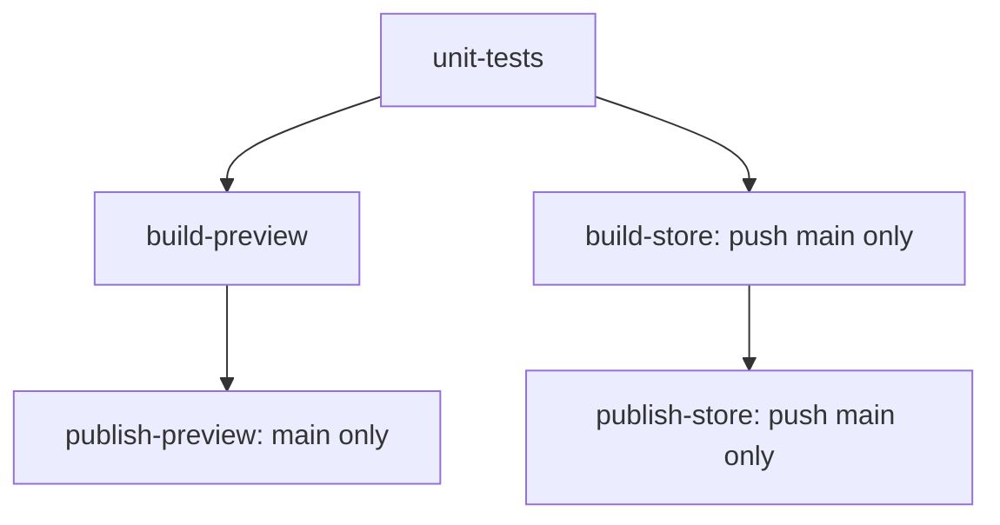

# מסירה לסשן הבנייה והשחרור של אנדרואיד

נבדק בקריאה בלבד ב־6.10.2026. זהו תכנון לשינוי בקובצי תהליכי הבנייה; לא מומש שינוי בתהליך השחרור ולא נגעתי בתיקיית האפליקציה. נדרשת סקירת הארכיטקט הקבוע לפני המימוש, לפי כלל 11 בהוראות הראשיות. סשן האנדרואיד הרשום בטבלת האחריות מחזיק בתיקיית האפליקציה.

## הבעיה והמצב הקיים

תהליך הבנייה והשחרור מרכז בדיקות יחידה, בניית גרסת הבדיקה החתומה ובניית קובץ החנות החתום באותה משימה. אם רק בניית החנות נכשלת, הפעלה חוזרת של המשימה מבצעת שוב גם את בדיקות היחידה ואת בניית גרסת הבדיקה. הפרסום נמצא במשימה נפרדת, אבל ממתין לסיום כל משימת הבנייה. ההערה בקוד שלפיה החנות נבנית אחרי פרסום גרסת הבדיקה אינה תואמת את גרף התלויות בפועל.

הקובץ:

```text
.github/workflows/android.yml
```

מקטעים בגרסה שנבדקה: בדיקות יחידה בשורות 59–60; גרסת הבדיקה בשורות 61–110; החנות בשורות 113–158; פרסום החל משורה 164. מפתחות החתימה נמצאים רק במשימת הבנייה, והרשאת כתיבה רק במשימת הפרסום. אלה גבולות שיש לשמר.

בדיקת האמולטור כבר בונה פעם אחת, מעבירה שני קובצי התקנה, ואז מפעילה משימה נפרדת לכל חלק שנבחר. ברירת המחדל המלאה היא 15 חלקים, אבל ריצה ידנית יכולה לבחור חלק יחיד. אין צורך ליצור מחדש את ההפרדה בין הבנייה לאמולטור. נשאר לחזק את ההרצות החוזרות ולבדוק מה לוקח זמן בתוך החלק שנבחר.

```text
.github/workflows/android-qa.yml
```

## הריצה המסוימת שהמשתמש הצביע עליה

הממשק הציבורי של הריצות חסום דרך כתובת הממשק לתוכנות, אבל סשן התיאום הצליח לקרוא את דף הריצה הציבורי. אלה זמני המשימות שמופיעים בו:

| חלק | זמן |
|---|---|
| כל הריצה | 11 דקות ו־40 שניות |
| הבנייה | 5 דקות ו־33 שניות |
| בדיקת האמולטור של דף הבית בלבד | 5 דקות ו־22 שניות |
| הפרסום | 31 שניות |

```text
https://github.com/pini236/gudauri-ski-trip/actions/runs/37470692283
branch: ccr-9127081e-kh3b91
commit: 5d096e6fe71ab2ec4a5b9c9c4a0aef00d1474113
```

זוהי הפעלה ידנית עם חלק יחיד, של דף הבית. אין כאן 15 משימות שרצו בפועל. זמן האמולטור כולל הורדות של מערכת האמולטור, יצירת מכשיר, אתחול, התקנת האפליקציה, בדיקת דף הבית, בדיקת הדיווח ובדיקת הפתיחה של גרסת השחרור. הקובץ המדויק של סקריפט הבדיקות מהקומיט הזה הורד ואומת כזהה לקובץ המקומי לפי הסכום הבא:

```text
SHA-256: 65e461ca8a119bf9363dd45f1644a0b1d3e76d379a075ec9ae8ec292bd5e45c4
```

בערך מחצית זמן הריצה היא בנייה. הפעלה חוזרת של משימת האמולטור באותה ריצה יכולה לחסוך את חמש דקות הבנייה כשהתוצרים עדיין קיימים; זהו חיסכון ישיר יותר מפיצול לחלקים, שכבר קיים. משך הזמן בתוך שלב האמולטור עדיין לא ידוע: דף הציבורי דורש כניסה כדי לראות את היומן, ולכן אי אפשר לקבוע כמה ממנו הם אתחול וכמה בדיקות. חיסכון נוסף מתמונת מצב של מכשיר נקי דורש מדידה.

לא הופעלה ריצת אמולטור חדשה. אבחון ההמתנות בהמשך הוא ניתוח קוד, וזמני המשימות בטבלה הם העדות החיה הזמינה.

## גרף המשימות המוצע



שמות המשימות המוצעים יציבים וברורים. שינוי במפתח ההעלאה או תקלה בבניית החנות ידרשו הפעלה חוזרת של משימת החנות בלבד. פרסום גרסת הבדיקה מתחיל מיד כשבנייתה מסתיימת, בלי להמתין לחנות. כשל בפרסום חוזר על הפרסום בלבד באמצעות הקובץ שכבר נבנה. כל בנייה ופרסום ממשיכים להיות חסומים אם בדיקות היחידה נכשלו.

| משימה | תלויות ותנאי | הפקודה או הפעולה | הרשאה וסודות |
|---|---|---|---|
| `unit-tests` | בכל הטריגרים הקיימים | `:app:testPreviewDebugUnitTest` | קריאה בלבד; בלי מפתחות חתימה ובלי אסימון שליחת מיפויים |
| `build-preview` | `needs: unit-tests`; בכל הטריגרים הקיימים | `:app:assemblePreviewRelease` | קריאה בלבד; מפתח בדיקה רק בראשי; מפתחות מדידה; אסימון מיפוי אם קיים |
| `build-store` | `needs: unit-tests`; רק דחיפה לראשי | `:app:bundleStoreRelease` | קריאה בלבד; מפתח העלאה, מפתחות מדידה ואסימון מיפוי אם קיים |
| `publish-preview` | `needs: build-preview`; רק בראשי, ורק אם הבנייה הצליחה | החלפת הנכס בגרסת הבדיקה הקבועה | כתיבה בלבד בשלב זה; אסימון גיטהאב; בלי מפתחות חתימה או מדידה |
| `publish-store` | `needs: build-store`; רק דחיפה לראשי, ורק אם הבנייה הצליחה | החלפת הנכס בגרסת החנות הקבועה | כתיבה בלבד בשלב זה; אסימון גיטהאב; בלי מפתחות חתימה או מדידה |

תנאי החנות נשמר בדיוק:

```yaml
if: github.event_name == 'push' && github.ref == 'refs/heads/main'
```

תנאי פרסום גרסת הבדיקה נשמר:

```yaml
if: github.ref == 'refs/heads/main'
```

ברירת המחדל ברמת התהליך נשארת:

```yaml
permissions:
  contents: read
```

רק בשתי משימות הפרסום:

```yaml
permissions:
  contents: write
```

### בנייה וחתימה

בכל משימת בנייה או יחידה: אותה בדיקת מקור, אותה גרסת ג'אווה 21, אותו כלי התקנת גריידל ואותן גרסאות ערכת הפיתוח. כל הכלים נשארים נעוצים באותם מזהי קומיט. אין שינוי בגרסאות הספריות או בקוד האפליקציה.

```text
platforms;android-37.2
build-tools;36.0.0
```

אותם ערכי גרסה בכל משימות הבנייה, וגם בהרצה חוזרת של אותו תהליך:

```yaml
APP_VERSION_CODE: ${{ github.run_number }}
APP_VERSION_NAME: 0.1.${{ github.run_number }}
```

מפתח הבדיקה מפוענח לקובץ זמני רק במשימת הבנייה של גרסת הבדיקה ורק בענף הראשי. בענפים אחרים נשמרת החתימה המקומית הקיימת. מפתח ההעלאה מפוענח רק במשימת בניית החנות ורק בדחיפה לראשי. אין להעלות מפתחות כתוצרים ואין לשמור אותם במטמון.

שמות הסודות נשמרים:

```text
ANDROID_TEST_KEYSTORE_BASE64
ANDROID_TEST_KEYSTORE_PASSWORD
ANDROID_TEST_KEY_ALIAS
ANDROID_UPLOAD_KEYSTORE_BASE64
ANDROID_UPLOAD_KEYSTORE_PASSWORD
ANDROID_UPLOAD_KEY_ALIAS
POSTHOG_KEY
SENTRY_DSN
SENTRY_AUTH_TOKEN
```

בדיקת תעודת גרסת הבדיקה נשארת כשל מחייב לפני העלאת התוצר:

```text
BA:09:08:B5:CB:5E:48:36:C7:78:70:B2:25:8E:5A:7B:43:13:45:34:81:4F:37:47:67:1D:6A:37:7C:E8:B3:06
```

בדיקת תעודת החנות נשארת כשל מחייב לפני העלאת התוצר:

```text
85:FB:FB:02:AE:0B:50:CC:53:92:55:4D:27:61:5E:A6:8E:2E:79:75:EB:8D:75:10:60:30:6D:A9:7D:D7:DD:31
```

מזהה מיפוי חדש נוצר בכל משימת בנייה שצריכה אותו, ונכתב למטא־נתונים לפני הבנייה. שולחים את קובץ המיפוי של אותו תוצר בלבד. כתובת השירות, הארגון והפרויקט נשמרים. הורדת כלי השליחה ממשיכה לאמת את הסכום הקיים. תקלה בשירות הדיווח אינה חוסמת שחרור, כפי שהוגדר כיום; כשל אימות החתימה ממשיך לחסום.

### פרסום

שני שלבי הפרסום שומרים את פונקציית החלפת הנכס הקיימת: העלאה בשם זמני, מחיקת הנכס הישן רק אחרי ההעלאה, ושינוי שם של החדש. אין למחוק וליצור מחדש את הגרסאות הקבועות. נשמרים שמות הקבצים, הקישורים וההערות עם גרסת הבנייה והקומיט.

```text
android-preview / ski-preview.apk
android-store / ski-store.aab
```

אין לשנות את מדיניות התור: דחיפה חדשה לענף רגיל מבטלת בנייה קודמת של אותו ענף; בראשי לא מבטלים תהליך באמצע חתימה או פרסום. אין להמיר את בדיקות המקור להרצה על קוד אחר באמצעות טריגר עם הרשאות רחבות.

## מטמון ותוצרים

כלי התקנת גריידל כבר שומר הורדות, ספריות, גרסאות הכלי וחלקים ממטמון הבנייה המקומי. אין צורך במטמון ידני נוסף לכל תיקיית המשתמש. מטמון הביצוע של משימות אינו מופעל כיום; אפשר להוסיף אותו לבניית גרסת הבדיקה, החנות ובניית האמולטור:

```bash
./gradlew --no-daemon --build-cache :app:assemblePreviewRelease
./gradlew --no-daemon --build-cache :app:bundleStoreRelease
```

בדיקות היחידה קוראות קבצים חיצוניים ישירות שאינם רשומים כיום כקלט של משימת הבדיקה: צבעי האתר, קוד המפה ומצב הרכבלים, חוזה השרת, תרחישים משותפים, רישיונות וקובץ הבנייה. כדי לא להחזיר תוצאת בדיקה ישנה אחרי שינוי חוזה, השלב הראשון משאיר את בדיקות היחידה בלי מטמון ביצוע:

```bash
./gradlew --no-daemon --no-build-cache :app:testPreviewDebugUnitTest
```

מטמון ההורדות נשאר פעיל גם בפקודה הזאת. אם רוצים בהמשך לשמור גם את קומפילציית בדיקות היחידה ותוצאותיהן, יש להצהיר על הקלטים האלה. אפשר לעשות זאת בקובץ אתחול זמני שנוצר בתהליך תחת תיקיית העבודה הזמנית של הרץ, או בתיאום עם סשן האנדרואיד בקובץ הבנייה. לא מפעילים מטמון תוצאות בדיקות לפני אימות שינוי של חוזה, צבע או תרחיש שחייב להריץ את הבדיקה מחדש. אין להפעיל מטמון הגדרות בלי המנגנון המוצפן הרשמי, ואין צורך בזה לתיקון הנוכחי.

לכל תוצר ששמו נשמר בהרצה חוזרת יש להגדיר החלפה מפורשת. תיעוד הכלי מציין שתוצר קיים באותו שם אינו ניתן לשינוי ושהעלאה ללא החלפה נכשלת. לא נצפה כשל כזה בהרצה חיה בסשן הזה.

```yaml
overwrite: true
retention-days: 14
if-no-files-found: error
```

ההגדרות האלה נדרשות לקובצי ההתקנה ולקובץ החנות; דוחות יחידה מועלים גם כשהבדיקה נכשלת, ולגביהם אפשר להגדיר אזהרה אם התהליך נעצר לפני יצירתם. יש להעלות דוחות יחידה מובנים יחד עם דוח הקריאה:

```text
app/android/app/build/test-results/testPreviewDebugUnitTest/
app/android/app/build/reports/tests/testPreviewDebugUnitTest/
```

גם קובצי ההתקנה של האמולטור צריכים להישמר 14 יום, כמו הדוחות, במקום יום אחד. כך חלק שנכשל מחר יכול להשתמש בבנייה המקורית. גיטהאב מאפשר הרצות חוזרות למשך 30 יום, אבל אחרי תפוגת התוצר צריך לבנות מחדש; יש להסביר זאת בתיעוד ולא לטעון שכל הרצה חוזרת תמיד חוסכת בנייה.

## הרצות חוזרות ובדיקה ממוקדת

הפעלה חוזרת של משימה משתמשת באותו קומיט ובאותו ענף של הריצה המקורית. היא אינה בודקת תיקון חדש שנדחף מאז. תיקון קוד צריך ריצה חדשה; בהרצה חדשה משתמשים במטמון אבל עדיין בונים את התוצר של הקומיט החדש.

כבר היום אפשר לבקש מגיטהאב להריץ רק משימות שנכשלו, במקום כל התהליך:

```bash
gh run rerun RUN_ID --failed --repo pini236/gudauri-ski-trip
```

ההרצה החוזרת כוללת גם משימות תלויות לפי גרף התהליך. אחרי הפיצול, כשל בחנות לא גורר את משימת היחידה או את בניית גרסת הבדיקה. כשל בפרסום לא גורר בנייה חדשה, כל עוד התוצר המקורי עדיין קיים. יש להוכיח זאת בריצה בענף ולבדוק את תצוגת ניסיונות הריצה והתוצרים לפני שמבטיחים את ההתנהגות למשתמש.

בדיקת האמולטור כבר תומכת בבחירת חלק אחד או כמה חלקים בהפעלה ידנית. אלה כל החלקים שהסקריפט מכיר, גם אלה שחסרים כרגע בתיאור השדה:

```text
map,descent,games,school,snowball,home,group,meet,status,run,locate,weather,lang,phone,store
```

דוגמה לבדיקת מזג האוויר בלבד בענף מסוים:

```bash
gh workflow run android-qa.yml \
  --repo pini236/gudauri-ski-trip \
  --ref BRANCH_NAME \
  -f scenario=weather \
  -f api=35
```

דוגמה לשני חלקים:

```bash
gh workflow run android-qa.yml \
  --repo pini236/gudauri-ski-trip \
  --ref BRANCH_NAME \
  -f scenario=locate,weather \
  -f api=35
```

אלה דוגמאות בלבד; לא הופעלו. ההפעלה הידנית הזאת עדיין בונה פעם אחת ומקימה אמולטור לכל חלק שנבחר. השימוש בהרצה חוזרת של משימה שנכשלה הוא הדרך להשתמש בתוצר הבנייה הקיים של אותו קומיט.

בסקריפט הנוכחי אין מזהי בדיקות, תוצאות מובנות לכל בדיקה או בחירה של בדיקה בודדת בתוך חלק. הבחירה היא חלק שלם. אין להציג את ההרצה החוזרת כהרצה של השורה הבודדת שנכשלה. פירוק נוסף, למשל שפות הטלפון או פעולות בקבוצה, דורש תיאום ושינוי של הסקריפט שבאחריות סשן האנדרואיד. כשל בחלק לא עוצר את כל האחים שלו כי ביטול מוקדם של המטריצה כבר כבוי.

בדיקת יחידה בודדת אפשר להריץ באמצעות המסנן הרשמי של גריידל. זהו כלי לאבחון, ואינו מחליף את בדיקות היחידה המלאות שמאפשרות שחרור:

```bash
cd app/android
./gradlew --no-daemon --no-build-cache \
  :app:testPreviewDebugUnitTest \
  --tests 'io.github.pini236.skiapp.weather.WeatherTest'
```

אם מוסיפים הפעלה ידנית לבדיקת יחידה מסוננת, היא חייבת להיות מצב אבחון נפרד שאינו בונה או מפרסם גרסאות. אין להפוך בדיקה מסוננת לשער שחרור.

## מפת ההמתנות באמולטור

| אזור בסקריפט | מנגנון המתנה | המשמעות |
|---|---|---|
| `waitlog`, שורות 42–50 | בדיקת שורה כל חצי שנייה עד מועד סיום; בדרך כלל 5–120 שניות | הצלחה מסיימת מיד; אלה גבולות עליונים, לא זמן קבוע |
| `uidump`, שורות 330–337; `tapText`, שורות 384–388 | עד 3 נסיונות צילום עץ; עד 3 חיפושים, ובכל חיפוש צילום מחדש | עד 9 קריאות יקרות לצילום עץ בלחיצה שלא מוצאת כפתור; זמן הקריאה הפנימית אינו חסום מפורשות |
| דף הבית שנבחר בריצה המסוימת, שורות 395–476 | צל רקע עד 90 שניות; יצירת טיול עם לוח שנה, שעון, בחירת שדה וחיפוש; שליפה והחלפת כרטיסים; ניווט והגדרות ורישיונות; 3 שפות תצוגה, בדיקת ברירת מחדל צרפתית ושחזור עברית | זו חבילה של זרימות רבות ולא בדיקה יחידה של מסך; הרבה מהלחיצות קוראות מחדש את עץ הנגישות. יש למדוד לפני שמפצלים או מקצרים המתנות |
| המפה, שורות 84–149 | פתיחות קרות, 8 מחוות, 5 מסלולים, 6 מצבי תאורה והמתנות צל עד 120 שניות | מועמד למדידה ופיצול עתידי, אבל פיצול מוסיף עלות הקמת אמולטורים |
| שפת הטלפון, שורות 631–667 | 4 שפות; הפעלה מחדש של מערכת לכל שפה, 5 ו־10 שניות המתנה קבועות, עד 60 בדיקות אתחול בהפרש 2 שניות, עד 3 נסיונות פתיחה של 30 שניות | מועמד בולט למסלול הארוך; לא ניתן לקבוע שזה החלק הארוך בפועל בלי מדידה |
| צילומי החנות, שורות 833–863 | כמה חישובי צל עד 120 שניות; צילום טיסה ומשחק לאחר המתנה | הכיסוי חזותי וכולל אנימציות, ולכן אין לכבות אותן כדי לקצר |
| בדיקת דיווח, שורה 893 | עד 20 שניות לאישור ריקון התור, ואז 5 שניות | רצה פעם אחת עם חלק מוגדר |
| בדיקת גרסת השחרור, שורות 909–917 | הסרת אפליקציה, התקנת גרסת שחרור, 12 שניות המתנה קבועות | רצה פעם אחת, עם אותו חלק מוגדר |

הקמת האמולטור עצמו מתבצעת מחוץ לסקריפט. כלי ההרצה מאפשר כברירת מחדל עד 600 שניות אתחול, ויוצר מכשיר חדש כל פעם. אפשר להוסיף מטמון של מכשיר נקי לפי הדוגמה הרשמית, עם יצירת תמונת מצב רק כשהמטמון חסר, ולהריץ אחר כך עם שמירה כבויה. מפתח המטמון צריך לכלול מערכת רץ, גרסת מערכת האמולטור, ארכיטקטורה, יעד, פרופיל, גרסת כלי האמולטור או תצורתו וגרסת תצורת המטמון. אין לשמור תמונת מצב אחרי התקנת האפליקציה או הרצת הבדיקות, כדי לא לערבב נתוני בדיקה, מצב משתמשים ושפה בין חלקים. שפת הטלפון ממשיכה לשנות ולהפעיל מחדש את המערכת במהלך בדיקתה גם עם מטמון נקי.

הכלי המוכתב כבר נשאר עם אנימציות פעילות, וזה נדרש לצילומי התנועה. אין להעתיק מהדוגמה הרשמית את כיבוי האנימציות בלי לבדוק את הכיסוי החזותי. מטמון תמונת מצב צריך אימות אמיתי באמולטור; חיסכון בזמן אינו מובטח עד שנמדדו גודל המטמון, זמן הורדתו וזמן האתחול.

## תנאי קבלה

1. סקירת הארכיטקט ותיאום עם סשן האנדרואיד לפני מימוש תהליך השחרור. ההצעה נשמרת לפי התבנית במסמך תפקיד הארכיטקט.
2. כל נתיבי ההפעלה והטריגרים הקיימים נשמרים. ריצה מלאה ממשיכה לבצע את כל בדיקות היחידה, לבנות גרסת בדיקה בכל ענף, ולבנות חנות רק בדחיפה לראשי.
3. בדיקות היחידה נכשלות: אין בנייה חתומה חדשה ואין פרסום. אין מפתחות חתימה או אסימון מיפוי במשימת היחידה.
4. כשל בבניית החנות: גרסת הבדיקה תקינה עדיין יכולה להתפרסם; הפעלה חוזרת אינה מריצה את הבדיקות או בונה אותה מחדש.
5. כשל בפרסום: הפעלה חוזרת משתמשת בתוצר הקיים; מזהה וגרסת הבנייה והקומיט תואמים לריצה המקורית.
6. בשתי הגרסאות נבדקת אותה תעודת חתימה, ומיפוי הדיווח מתאים לתוצר. אימות סכום ההורדה נשמר.
7. הענפים אינם מחזיקים במפתחות החתימה. משימות הפרסום אינן מחזיקות במפתחות חתימה. סודות וקובצי מפתח אינם מופיעים בתוצרים או במטמון.
8. הפעלה חוזרת של חלק אמולטור שנכשל מצליחה להחליף את תוצאתו ולפרסם סיכום מעודכן, בלי לבנות מחדש ובלי להריץ אחים שכבר הצליחו. הסיכום מציג את כל החלקים הצפויים; חלק חסר אינו נראה כהצלחה.
9. כל 15 חלקי האמולטור נשמרים בהרצה מלאה; בדיקות הדיווח והפתיחה של גרסת השחרור עדיין מתבצעות פעם אחת. בדיקה ממוקדת מוצגת כבדיקה ממוקדת.
10. מסנן לא תקין נדחה לפני הבנייה. אין לפרש חלק לא מוכר כבקשה להריץ את כל הבדיקות, כפי שעושה כיום ברירת המחדל בסקריפט.
11. שינוי בקובץ חוזה או תרחיש משותף אכן מפעיל שוב את בדיקות היחידה; אין שימוש בתוצאת מטמון ישנה. דוחות היחידה זמינים גם בכשל.
12. מתועדים זמני תור, בנייה, אתחול אמולטור וחלקי הבדיקה בריצה קרה וחמה. אין טענה לאחוז קיצור לפני המדידה.

## מקורות רשמיים שנקראו

- כלי העלאת תוצרים, גרסה נעוצה: https://github.com/actions/upload-artifact/blob/ea165f8d65b6e75b540449e92b4886f43607fa02/README.md — תוצר שאינו ניתן לשינוי, החלפה, זמן שמירה ורמת דחיסה.
- כלי הרצת האמולטור, גרסה נעוצה: https://github.com/ReactiveCircus/android-emulator-runner/blob/a421e43855164a8197daf9d8d40fe71c6996bb0d/README.md — דוגמת מטמון תמונת מצב, יצירת מכשיר מחדש ומועד סיום לאתחול.
- כלי הגדרת גריידל, גרסה נעוצה: https://github.com/gradle/actions/blob/ed408507eac070d1f99cc633dbcf757c94c7933a/docs/setup-gradle.md — מטמון פעיל כברירת מחדל, כתיבה רק מהענף הראשי והצפנת מטמון הגדרות.
